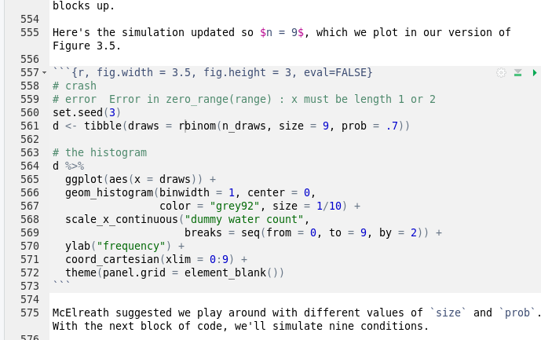
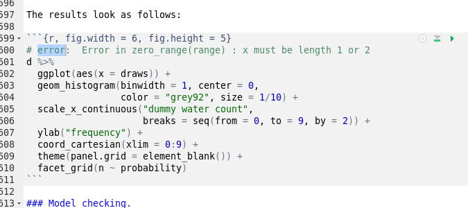
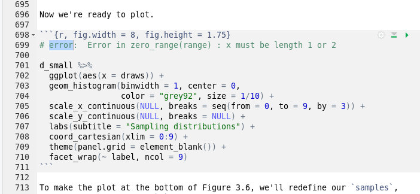
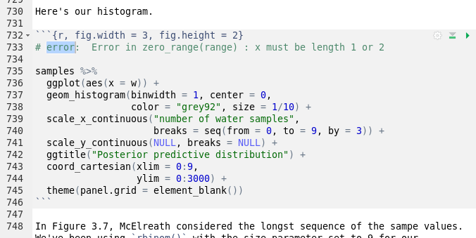
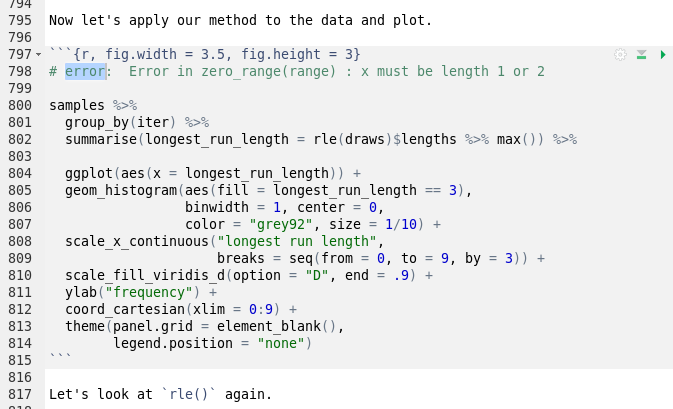
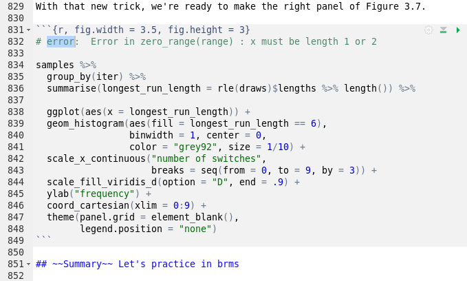

# kurtz-rethinking bookdown

[toc]

## Bookdown details
* R-3.6.3
* RStudio 1.2.5042
* MRAN dated on `2019-06-12`


## Build and run

### Build container

Build with:

```
docker build  -f Dockerfile -t f0nzie/kurtz-rethinking .
```


### Run container

```
docker run --rm -p 8787:8787 -v /home/msfz751/docker-share/kurtz:/home/rstudio/share  -e USERID=$UID -e PASSWORD=kurtz f0nzie/kurtz-rethinking
```

> **Note**. We will replace this a script that also shares the `book` folder.


### Build book

```
Rscript -e 'bookdown::render_book(input = "index.Rmd", output_format = "bookdown::gitbook", output_dir = "public", clean_envir = FALSE)'
```

> **Note**. We will replace this with a script.


## Frequent errors

```
 Error in zero_range(range) : x must be length 1 or 2
```

 These errors happen in several chapters. Start at section 3:
 * lines 556, and on. All errors are related to `ggplot2`

 


















## Scripts

### Dockerfile

```
FROM rocker/rstudio:3.6.3


RUN apt-get -y update \
 && apt-get -y install  \
    libxml2-dev \
    libz-dev

# needed by V8, shape
RUN apt-get -y update \
 && apt-get -y install  \
    libv8-dev 

RUN apt-get -y update \
 && apt-get -y install  \
    libfontconfig1-dev \
    libcairo2-dev

RUN install2.r --error \
    haven \
    tibble \
    xml2 

# Install R packages
RUN install2.r --error \
  bayesplot \
  brms \
  BH \
  broom \
  ghibli \
  gridExtra \
  ggrepel \
  GGally \
#  grid \
  ggthemes \
  ggbeeswarm \
  igraph \
  loo \
  Matrix \
  MCMCglmm \
  mapproj \
  pacman \
  psych \
#  rethinking \
  rstan \
  rcartocolor \
  shinystan \
  threejs \
  tidybayes \
  tidyverse \
#  parallel \
  viridis \
  wesanderson

# needed by 
RUN install2.r --error \
    # Cairo \
    systemfonts \
    extrafont \
    gdtools

# needed by rethinking
RUN install2.r --error \
    bookdown \
    dagitty \
    shape


COPY hrbrthemes /home/rstudio/pkg/hrbrthemes
COPY fiftystater /home/rstudio/pkg/fiftystater
COPY dutchmasters /home/rstudio/pkg/dutchmasters
COPY rethinking /home/rstudio/pkg/rethinking
COPY scales /home/rstudio/pkg/scales

RUN Rscript -e "install.packages('/home/rstudio/pkg/hrbrthemes', repos = NULL, type='source')"
RUN Rscript -e "install.packages('/home/rstudio/pkg/fiftystater', repos = NULL, type='source')"
RUN Rscript -e "install.packages('/home/rstudio/pkg/dutchmasters', repos = NULL, type='source')"
RUN Rscript -e "install.packages('/home/rstudio/pkg/rethinking', repos = NULL, type='source')"
RUN Rscript -e "install.packages('/home/rstudio/pkg/scales', repos = NULL, type='source')"


COPY book /home/rstudio/book
RUN chmod a+rwx -R /home/rstudio/book
```


## Dependencies

```
ERROR: dependencies ‘farver’, ‘lifecycle’ are not available for package ‘scales’
```