# Adventures in Covariance

> In this chapter, you’ll see how to… specify varying slopes in combination with the varying intercepts of the previous chapter. This will enable pooling that will improve estimates of how different units respond to or are influenced by predictor variables. It will also improve estimates of intercepts, by borrowing information across parameter types. Essentially, varying slopes models are massive interaction machines. They allow every unit in the data to have its own unique response to any treatment or exposure or event, while also improving estimates via pooling. When the variation in slopes is large, the average slope is of less interest. Sometimes, the pattern of variation in slopes provides hints about omitted variables that explain why some units respond more or less. We’ll see an example in this chapter.
>
> The machinery that makes such complex varying effects possible will be used later in the chapter to extend the varying effects strategy to more subtle model types, including the use of continuous categories, using Gaussian process. (p. 388)

## Varying slopes by construction

> How should the robot pool information across intercepts and slopes? By modeling the joint population of intercepts and slopes, which means by modeling their covariance. In conventional multilevel models, the device that makes this possible is a joint multivariate Gaussian distribution for all of the varying effects, both intercepts and slopes. So instead of having two independent Gaussian distributions of intercepts and of slopes, the robot can do better by assigning a two-dimensional Gaussian distribution to both the intercepts (first dimension) and the slopes (second dimension). (p. 389)

In the **Rethinking: Why Gaussian?** box, McElreath discussed how researchers might use other multivariate distributions to model multiple random effects. The only one he named as an alternative to the Gaussian was the multivariate Student’s $t$. As it turns out, brms does currently allow users to use multivariate Student’s $t$ in this way. For details, check out [this discussion in the brms GitHub page](https://github.com/paul-buerkner/brms/issues/231). Bürkner's exemplar syntax from his comment on May 13, 2018, was `y ~ x + (x | gr(g, dist = "student"))`. I haven't experimented with this, but if you do, do consider [commenting on how it went](https://github.com/ASKurz/Statistical_Rethinking_with_brms_ggplot2_and_the_tidyverse/issues).

### Simulate the population.

If you follow this section closely, it’s a great template for simulating multilevel code for any of your future projects. You might think of this as an alternative to a frequentist power analysis. Vourre has done [some nice work along these lines](https://gitlab.com/vuorre/bayesplan), too.


```r
a       <-  3.5  # average morning wait time
b       <- -1    # average difference afternoon wait time
sigma_a <-  1    # std dev in intercepts
sigma_b <-  0.5  # std dev in slopes
rho     <- -.7   # correlation between intercepts and slopes

# the next three lines of code simply combine the terms, above
mu     <- c(a, b)
cov_ab <- sigma_a * sigma_b * rho
sigma  <- matrix(c(sigma_a^2, cov_ab, 
                   cov_ab, sigma_b^2), ncol = 2)
```

If you haven't used `matirx()` before, you might get a sense of the elements like so.


```r
matrix(c(1, 2, 
         3, 4), nrow = 2, ncol = 2)
```

```
##      [,1] [,2]
## [1,]    1    3
## [2,]    2    4
```

This next block of code will finally yield our café data.


```r
library(tidyverse)

sigmas <- c(sigma_a, sigma_b)          # standard deviations
rho    <- matrix(c(1, rho,             # correlation matrix
                   rho, 1), nrow = 2)

# now matrix multiply to get covariance matrix
sigma <- diag(sigmas) %*% rho %*% diag(sigmas)

# how many cafes would you like?
n_cafes <- 20

set.seed(13)  # used to replicate example
vary_effects <- 
  MASS::mvrnorm(n_cafes, mu, sigma) %>% 
  data.frame() %>% 
  set_names("a_cafe", "b_cafe")

head(vary_effects)
```

```
##     a_cafe     b_cafe
## 1 2.917639 -0.8649154
## 2 3.552770 -1.6814372
## 3 1.694390 -0.4168858
## 4 3.442417 -0.6011724
## 5 2.289988 -0.7461953
## 6 3.069283 -0.8839639
```

Let’s make sure we’re keeping this all straight. ` a_cafe ` = our café-specific intercepts; `b_cafe ` = our café-specific slopes. These aren’t the actual data, yet. But at this stage, it might make sense to ask *What's the distribution of `a_cafe` and `b_cafe`?* Our variant of Figure 13.2 contains the answer.

For our plots in this chapter, we'll use a custom theme. The color palette will come from the "pearl_earring" palette of the [dutchmasters package](https://github.com/EdwinTh/dutchmasters). You can learn more about the original painting, Vermeer's *Girl with a Pearl Earring*, [here](https://en.wikipedia.org/wiki/Girl_with_a_Pearl_Earring).


```r
# devtools::install_github("EdwinTh/dutchmasters")
library(dutchmasters)

dutchmasters$pearl_earring
```

```
##         red(lips)              skin      blue(scarf1)      blue(scarf2)      white(colar) 
##         "#A65141"         "#E7CDC2"         "#80A0C7"         "#394165"         "#FCF9F0" 
##       gold(dress)      gold(dress2) black(background)      grey(scarf3)    yellow(scarf4) 
##         "#B1934A"         "#DCA258"         "#100F14"         "#8B9DAF"         "#EEDA9D" 
##                   
##         "#E8DCCF"
```

We'll name our custom theme `theme_pearl_earring`.


```r
theme_pearl_earring <-
  theme(text       = element_text(color = "#E8DCCF", family = "Courier"),
        strip.text = element_text(color = "#E8DCCF", family = "Courier"),
        axis.text  = element_text(color = "#E8DCCF"),
        axis.ticks = element_line(color = "#E8DCCF"),
        line       = element_line(color = "#E8DCCF"),
        plot.background   = element_rect(fill = "#100F14", color = "transparent"),
        panel.background  = element_rect(fill = "#100F14", color = "#E8DCCF"),
        strip.background  = element_rect(fill = "#100F14", color = "transparent"),
        panel.grid = element_blank(),
        legend.background = element_rect(fill = "#100F14", color = "transparent"),
        legend.key        = element_rect(fill = "#100F14", color = "transparent"),
        axis.line = element_blank())
```

Now we're ready to plot Figure 13.2.


```r
vary_effects %>% 
  ggplot(aes(x = a_cafe, y = b_cafe)) +
  geom_point(color = "#80A0C7") +
  geom_rug(color = "#8B9DAF", size = 1/7) +
  theme_pearl_earring
```

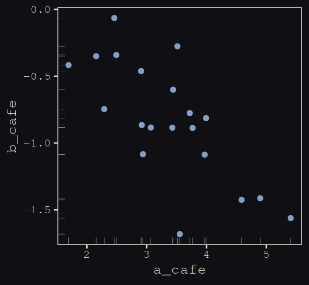

Again, these are not "data." Figure 13.2 shows a distribution of *parameters*.

### Simulate observations.

Here we put those simulated parameters to use.


```r
n_visits <- 10
sigma    <-  0.5  # std dev within cafes

set.seed(13)  # used to replicate example
d <-
  vary_effects %>% 
  mutate(cafe      = 1:n_cafes) %>% 
  expand(nesting(cafe, a_cafe, b_cafe), visit = 1:n_visits) %>% 
  mutate(afternoon = rep(0:1, times = n() / 2)) %>% 
  mutate(mu        = a_cafe + b_cafe * afternoon) %>% 
  mutate(wait      = rnorm(n = n(), mean = mu, sd = sigma))
```

We might peek at the data.


```r
d %>%
  head()
```

```
## # A tibble: 6 x 7
##    cafe a_cafe b_cafe visit afternoon    mu  wait
##   <int>  <dbl>  <dbl> <int>     <int> <dbl> <dbl>
## 1     1   2.92 -0.865     1         0  2.92  3.19
## 2     1   2.92 -0.865     2         1  2.05  1.91
## 3     1   2.92 -0.865     3         0  2.92  3.81
## 4     1   2.92 -0.865     4         1  2.05  2.15
## 5     1   2.92 -0.865     5         0  2.92  3.49
## 6     1   2.92 -0.865     6         1  2.05  2.26
```

Now we've finally simulated our data, we are ready to make our version of Figure 13.1, from way back on page 388.


```r
d %>%
  mutate(afternoon = ifelse(afternoon == 0, "M", "A"),
         day       = rep(rep(1:5, each = 2), times = n_cafes)) %>%
  filter(cafe %in% c(3, 5)) %>%
  mutate(cafe = ifelse(cafe == 3, "cafe #3", "cafe #5")) %>%
  
  ggplot(aes(x = visit, y = wait, group = day)) +
  geom_point(aes(color = afternoon), size = 2) +
  geom_line(color = "#8B9DAF") +
  scale_color_manual(values = c("#80A0C7", "#EEDA9D")) +
  scale_x_continuous(NULL, breaks = 1:10,
                     labels = rep(c("M", "A"), times = 5)) +
  coord_cartesian(ylim = 0:4) +
  ylab("wait time in minutes") +
  theme_pearl_earring +
  theme(legend.position = "none",
        axis.ticks.x    = element_blank()) +
  facet_wrap(~cafe, ncol = 1)
```

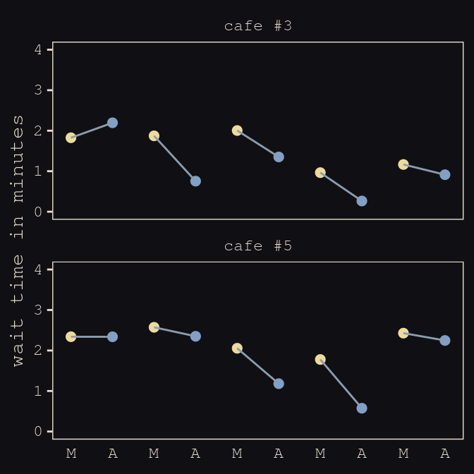

### The varying slopes model.

The statistical formula for our varying-slopes model follows the form

\begin{align*}
\text{wait}_i & \sim \text{Normal} (\mu_i, \sigma) \\
\mu_i         & = \alpha_{\text{cafe}_i} + \beta_{\text{cafe}_i} \text{afternoon}_i \\
\begin{bmatrix} \alpha_\text{cafe} \\ \beta_\text{cafe} \end{bmatrix} & \sim \text{MVNormal} \bigg (\begin{bmatrix} \alpha \\ \beta \end{bmatrix}, \mathbf{S}  \bigg ) \\
\mathbf S     & = \begin{pmatrix} \sigma_\alpha & 0 \\ 0 & \sigma_\beta \end{pmatrix} \mathbf R \begin{pmatrix} \sigma_\alpha & 0 \\ 0 & \sigma_\beta \end{pmatrix} \\
\alpha        & \sim \text{Normal} (0, 10) \\
\beta         & \sim \text{Normal} (0, 10) \\
\sigma        & \sim \text{HalfCauchy} (0, 1) \\
\sigma_\alpha & \sim \text{HalfCauchy} (0, 1) \\
\sigma_\beta  & \sim \text{HalfCauchy} (0, 1) \\
\mathbf R     & \sim \text{LKJcorr} (2)
\end{align*}

Of the notable new parts, $\mathbf S$ is the covariance matrix and $\mathbf R$ is the corresponding correlation matrix, which we might more fully express as

$$\begin{pmatrix} 1 & \rho \\ \rho & 1 \end{pmatrix}$$

And according to our prior, $\mathbf R$ is distributed as $\text{LKJcorr} (2)$. We'll use `rethinking::rlkjcorr()` to get a better sense of what that even is.


```r
library(rethinking)

n_sim <- 1e5

set.seed(13)
r_1 <- 
  rlkjcorr(n_sim, K = 2, eta = 1) %>%
  as_tibble()

set.seed(13)
r_2 <- 
  rlkjcorr(n_sim, K = 2, eta = 2) %>%
  as_tibble()

set.seed(13)
r_4 <- 
  rlkjcorr(n_sim, K = 2, eta = 4) %>%
  as_tibble()
```

Here are the $\text{LKJcorr}$ distributions of Figure 13.3.


```r
ggplot(data = r_1, aes(x = V2)) +
  geom_density(color = "transparent", fill = "#DCA258", alpha = 2/3) +
  geom_density(data = r_2,
               color = "transparent", fill = "#FCF9F0", alpha = 2/3) +
  geom_density(data = r_4,
               color = "transparent", fill = "#394165", alpha = 2/3) +
  geom_text(data = tibble(x     = c(.83, .62, .46),
                          y     = c(.54, .74, 1),
                          label = c("eta = 1", "eta = 2", "eta = 4")),
            aes(x = x, y = y, label = label),
            color = "#A65141", family = "Courier") +
  scale_y_continuous(NULL, breaks = NULL) +
  xlab("correlation") +
  theme_pearl_earring
```

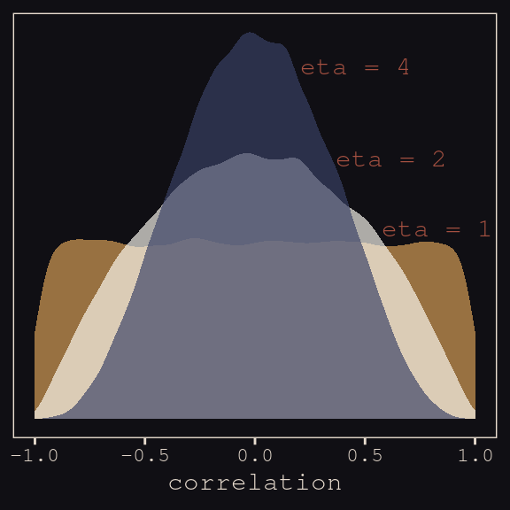

Okay, let's get ready to model and switch out rethinking for brms.


```r
detach(package:rethinking, unload = T)
library(brms)
```

As defined above, our first model has both varying intercepts and `afternoon` slopes. I should point out that the `(1 + afternoon | cafe)` syntax specifies that we'd like `brm()` to fit the random effects for `1` (i.e., the intercept) and the `afternoon` slope as correlated. Had we wanted to fit a model in which they were orthogonal, we'd have coded `(1 + afternoon || cafe)`.


```r
 b13.1 <- 
  brm(data = d, family = gaussian,
      wait ~ 1 + afternoon + (1 + afternoon | cafe),
      prior = c(prior(normal(0, 10), class = Intercept),
                prior(normal(0, 10), class = b),
                prior(cauchy(0, 2), class = sd),
                prior(cauchy(0, 2), class = sigma),
                prior(lkj(2), class = cor)),
      iter = 5000, warmup = 2000, chains = 2, cores = 2,
      seed = 13)
```

With Figure 13.4, we assess how the posterior for the correlation of the random effects compares to its prior.


```r
post <- posterior_samples(b13.1)

post %>%
  ggplot(aes(x = cor_cafe__Intercept__afternoon)) +
  geom_density(data = r_2, aes(x = V2),
               color = "transparent", fill = "#EEDA9D", alpha = 3/4) +
  geom_density(color = "transparent", fill = "#A65141", alpha = 9/10) +
  annotate("text", label = "posterior", 
           x = -0.35, y = 2.2, 
           color = "#A65141", family = "Courier") +
  annotate("text", label = "prior", 
           x = 0, y = 0.9, 
           color = "#EEDA9D", alpha = 2/3, family = "Courier") +
  scale_y_continuous(NULL, breaks = NULL) +
  xlab("correlation") +
  theme_pearl_earring
```

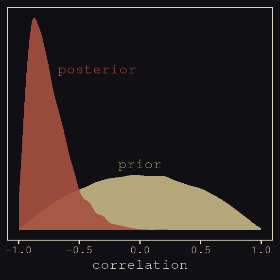

McElreath then depicted multidimensional shrinkage by plotting the posterior mean of the varying effects compared to their raw, unpooled estimated. With brms, we can get the `cafe`-specific intercepts and `afternoon` slopes with `coef()`, which returns a three-dimensional list.


```r
# coef(b13.1) %>% glimpse()

coef(b13.1)
```

```
## $cafe
## , , Intercept
## 
##    Estimate Est.Error     Q2.5    Q97.5
## 1  3.259169 0.1992591 2.878429 3.653497
## 2  3.163126 0.2077802 2.764231 3.571470
## 3  1.613333 0.2048788 1.214071 2.020841
## 4  3.335507 0.1974706 2.949594 3.734603
## 5  2.297652 0.2021495 1.902246 2.694731
## 6  3.144568 0.2000372 2.749660 3.537188
## 7  2.649992 0.2038993 2.242362 3.045645
## 8  3.640516 0.2024258 3.247909 4.042081
## 9  4.115420 0.1996007 3.723008 4.501883
## 10 2.324889 0.2079583 1.908449 2.727862
## 11 4.443441 0.2001195 4.055028 4.835634
## 12 2.832879 0.1957106 2.448516 3.221008
## 13 4.650760 0.2098050 4.237949 5.057530
## 14 5.524169 0.2177284 5.097501 5.959747
## 15 3.560360 0.1970021 3.164246 3.949434
## 16 3.487883 0.2025698 3.086784 3.882643
## 17 2.339923 0.1998181 1.958140 2.726994
## 18 3.957517 0.2016838 3.564045 4.358334
## 19 3.497136 0.1981075 3.106978 3.875221
## 20 3.171816 0.1984817 2.772357 3.567600
## 
## , , afternoon
## 
##      Estimate Est.Error       Q2.5        Q97.5
## 1  -0.9079492 0.2121886 -1.3423270 -0.514139515
## 2  -1.0423543 0.2421118 -1.5661461 -0.632140118
## 3  -0.4258897 0.2309383 -0.8744802  0.019952192
## 4  -0.7371826 0.2082224 -1.1318710 -0.301357371
## 5  -0.5473586 0.2146359 -0.9547521 -0.114297666
## 6  -0.7922547 0.1984415 -1.1808542 -0.394098256
## 7  -0.4923971 0.2273306 -0.8963698 -0.009312471
## 8  -0.8182089 0.2064763 -1.2103869 -0.391837649
## 9  -1.0795703 0.2080591 -1.5121735 -0.694212786
## 10 -0.4328146 0.2339193 -0.8541180  0.055244404
## 11 -1.0918230 0.2181998 -1.5358138 -0.660927426
## 12 -0.7572787 0.2058866 -1.1944722 -0.357107659
## 13 -1.2090494 0.2262855 -1.6698164 -0.774227341
## 14 -1.5270601 0.2677825 -2.0575562 -1.017941161
## 15 -0.9245022 0.1973630 -1.3248250 -0.541319337
## 16 -0.7358376 0.2157176 -1.1299586 -0.283584441
## 17 -0.5644189 0.2135701 -0.9745232 -0.132798311
## 18 -1.0058122 0.2049376 -1.4275187 -0.611649272
## 19 -0.7452130 0.2103995 -1.1244911 -0.296927032
## 20 -0.7322933 0.2046215 -1.1238668 -0.302647160
```

Here's the code to extract the relevant elements from the `coef()` list, convert them to a tibble, and add the `cafe` index.


```r
partially_pooled_params <-
  # with this line we select each of the 20 cafe's posterior mean (i.e., Estimate)
  # for both `Intercept` and `afternoon`
  coef(b13.1)$cafe[ , 1, 1:2] %>%
  as_tibble() %>%               # convert the two vectors to a tibble
  rename(Slope = afternoon) %>%
  mutate(cafe = 1:nrow(.)) %>%  # add the `cafe` index
  select(cafe, everything())    # simply moving `cafe` to the leftmost position
```

Like McElreath, we'll compute the unpooled estimates directly from the data.


```r
# compute unpooled estimates directly from data
un_pooled_params <-
  d %>%
  # with these two lines, we compute the mean value for each cafe's wait time 
  # in the morning and then the afternoon
  group_by(afternoon, cafe) %>%
  summarise(mean = mean(wait)) %>%
  ungroup() %>%  # ungrouping allows us to alter afternoon, one of the grouping variables
  mutate(afternoon = ifelse(afternoon == 0, "Intercept", "Slope")) %>%
  spread(key = afternoon, value = mean) %>%  # use `spread()` just as in the previous block
  mutate(Slope = Slope - Intercept)          # finally, here's our slope!

# here we combine the partially-pooled and unpooled means into a single data object, 
# which will make plotting easier.
params <-
  # `bind_rows()` will stack the second tibble below the first
  bind_rows(partially_pooled_params, un_pooled_params) %>%
  # index whether the estimates are pooled
  mutate(pooled = rep(c("partially", "not"), each = nrow(.)/2)) 

# here's a glimpse at what we've been working for
params %>%
  slice(c(1:5, 36:40))
```

```
## # A tibble: 10 x 4
##     cafe Intercept  Slope pooled   
##    <int>     <dbl>  <dbl> <chr>    
##  1     1      3.26 -0.908 partially
##  2     2      3.16 -1.04  partially
##  3     3      1.61 -0.426 partially
##  4     4      3.34 -0.737 partially
##  5     5      2.30 -0.547 partially
##  6    16      3.38 -0.465 not      
##  7    17      2.29 -0.531 not      
##  8    18      4.01 -1.07  not      
##  9    19      3.39 -0.484 not      
## 10    20      3.12 -0.617 not
```

Finally, here's our code for Figure 13.5.a, showing shrinkage in two dimensions.


```r
ggplot(data = params, aes(x = Intercept, y = Slope)) +
  stat_ellipse(geom = "polygon", type = "norm", level = 1/10, size = 0, alpha = 1/20, fill = "#E7CDC2") +
  stat_ellipse(geom = "polygon", type = "norm", level = 2/10, size = 0, alpha = 1/20, fill = "#E7CDC2") +
  stat_ellipse(geom = "polygon", type = "norm", level = 3/10, size = 0, alpha = 1/20, fill = "#E7CDC2") +
  stat_ellipse(geom = "polygon", type = "norm", level = 4/10, size = 0, alpha = 1/20, fill = "#E7CDC2") +
  stat_ellipse(geom = "polygon", type = "norm", level = 5/10, size = 0, alpha = 1/20, fill = "#E7CDC2") +
  stat_ellipse(geom = "polygon", type = "norm", level = 6/10, size = 0, alpha = 1/20, fill = "#E7CDC2") +
  stat_ellipse(geom = "polygon", type = "norm", level = 7/10, size = 0, alpha = 1/20, fill = "#E7CDC2") +
  stat_ellipse(geom = "polygon", type = "norm", level = 8/10, size = 0, alpha = 1/20, fill = "#E7CDC2") +
  stat_ellipse(geom = "polygon", type = "norm", level = 9/10, size = 0, alpha = 1/20, fill = "#E7CDC2") +
  stat_ellipse(geom = "polygon", type = "norm", level = .99,  size = 0, alpha = 1/20, fill = "#E7CDC2") +
  geom_point(aes(group = cafe, color = pooled)) +
  geom_line(aes(group = cafe), size = 1/4) +
  scale_color_manual("Pooled?",
                     values = c("#80A0C7", "#A65141")) +
  coord_cartesian(xlim = range(params$Intercept),
                  ylim = range(params$Slope)) +
  theme_pearl_earring
```

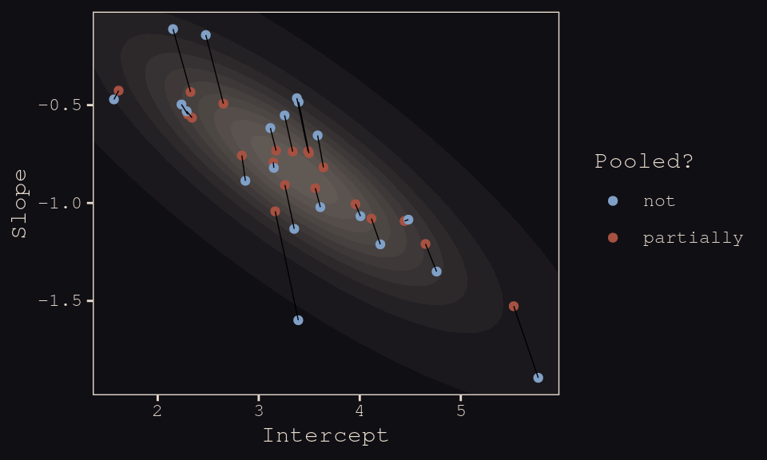

Learn more about `stat_ellipse()`, [here](https://ggplot2.tidyverse.org/reference/stat_ellipse.html). Let's prep for Figure 13.5.b.


```r
# retrieve the partially-pooled estimates with `coef()`
partially_pooled_estimates <-
  coef(b13.1)$cafe[ , 1, 1:2] %>%
  # convert the two vectors to a tibble
  as_tibble() %>%
  # the Intercept is the wait time for morning (i.e., `afternoon == 0`)
  rename(morning = Intercept) %>%
  # `afternoon` wait time is the `morning` wait time plus the afternoon slope
  mutate(afternoon = morning + afternoon,
         cafe      = 1:n()) %>%  # add the `cafe` index
  select(cafe, everything()) 

# compute unpooled estimates directly from data
un_pooled_estimates <-
  d %>%
  # as above, with these two lines, we compute each cafe's mean wait value by time of day
  group_by(afternoon, cafe) %>% 
  summarise(mean = mean(wait)) %>%
  # ungrouping allows us to alter the grouping variable, afternoon
  ungroup() %>% 
  mutate(afternoon = ifelse(afternoon == 0, "morning", "afternoon")) %>%
  # this seperates out the values into morning and afternoon columns
  spread(key = afternoon, value = mean)

estimates <-
  bind_rows(partially_pooled_estimates, un_pooled_estimates) %>%
  mutate(pooled = rep(c("partially", "not"), each = n() / 2))
```

The code for Figure 13.5.b.


```r
ggplot(data = estimates, aes(x = morning, y = afternoon)) +
  # nesting `stat_ellipse()` within `mapply()` is a less redundant way to produce the 
  # ten-layered semitransparent ellipses we did with ten lines of `stat_ellipse()` 
  # functions in the previous plot
  mapply(function(level) {
    stat_ellipse(geom  = "polygon", type = "norm",
                 size  = 0, alpha = 1/20, fill = "#E7CDC2",
                 level = level)
    }, 
    # Enter the levels here
    level = c(seq(from = 1/10, to = 9/10, by = 1/10), .99)) +
  geom_point(aes(group = cafe, color = pooled)) +
  geom_line(aes(group = cafe), size = 1/4) +
  scale_color_manual("Pooled?",
                     values = c("#80A0C7", "#A65141")) +
  coord_cartesian(xlim = range(estimates$morning),
                  ylim = range(estimates$afternoon)) +
  labs(x = "morning wait (mins)",
       y = "afternoon wait (mins)") +
  theme_pearl_earring
```

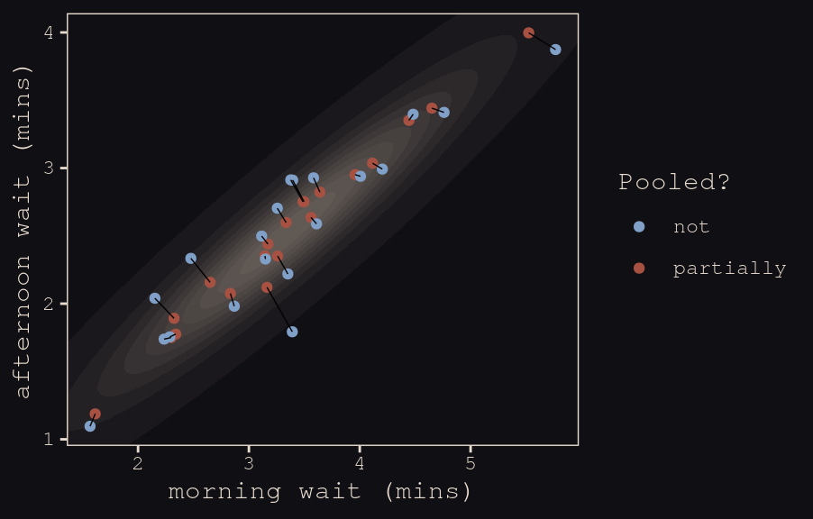

## Example: Admission decisions and gender

Let's revisit the infamous UCB admissions data.


```r
library(rethinking)
data(UCBadmit)
d <- UCBadmit
```

Here we detach rethinking, reload brms, and augment the data a bit.


```r
detach(package:rethinking, unload = T)
library(brms)
rm(UCBadmit)

d <- 
  d %>%
  mutate(male    = ifelse(applicant.gender == "male", 1, 0),
         dept_id = rep(1:6, each = 2))
```

### Varying intercepts.

The statistical formula for our varying-intercepts logistic regression model follows the form

\begin{align*}
\text{admit}_i         & \sim \text{Binomial} (n_i, p_i) \\
\text{logit} (p_i)     & = \alpha_{\text{dept_id}_i} + \beta \text{male}_i \\
\alpha_\text{dept_id} & \sim \text{Normal} (\alpha, \sigma) \\
\alpha                 & \sim \text{Normal} (0, 10) \\
\beta                  & \sim \text{Normal} (0, 1) \\
\sigma                 & \sim \text{HalfCauchy} (0, 2) \\
\end{align*}

Since there’s only one left-hand term in our `(1 | dept_id)` code, there’s only one random effect.


```r
b13.2 <- 
  brm(data = d, family = binomial,
      admit | trials(applications) ~ 1 + male + (1 | dept_id),
      prior = c(prior(normal(0, 10), class = Intercept),
                prior(normal(0, 1), class = b),
                prior(cauchy(0, 2), class = sd)),
      iter = 4500, warmup = 500, chains = 3, cores = 3,
      seed = 13,
      control = list(adapt_delta = 0.99))
```

Since we don't have a `depth=2` argument in `brms::summary()`, we'll have to get creative. One way to look at the parameters is with `b13.2$fit`:


```r
b13.2$fit
```

```
## Inference for Stan model: 3056b2b8cf03dcc8f1a993c6328a1e5a.
## 3 chains, each with iter=4500; warmup=500; thin=1; 
## post-warmup draws per chain=4000, total post-warmup draws=12000.
## 
##                          mean se_mean   sd   2.5%    25%    50%    75%  97.5% n_eff Rhat
## b_Intercept             -0.61    0.02 0.65  -1.95  -0.97  -0.59  -0.23   0.68  1699    1
## b_male                  -0.09    0.00 0.08  -0.26  -0.15  -0.09  -0.04   0.07  5332    1
## sd_dept_id__Intercept    1.48    0.01 0.60   0.77   1.10   1.35   1.71   2.99  1794    1
## r_dept_id[1,Intercept]   1.28    0.02 0.65   0.00   0.91   1.26   1.64   2.62  1716    1
## r_dept_id[2,Intercept]   1.24    0.02 0.65  -0.05   0.86   1.22   1.60   2.59  1719    1
## r_dept_id[3,Intercept]   0.03    0.02 0.65  -1.25  -0.35   0.01   0.39   1.37  1717    1
## r_dept_id[4,Intercept]  -0.01    0.02 0.65  -1.29  -0.38  -0.03   0.35   1.34  1708    1
## r_dept_id[5,Intercept]  -0.45    0.02 0.65  -1.75  -0.83  -0.47  -0.08   0.89  1707    1
## r_dept_id[6,Intercept]  -2.00    0.02 0.66  -3.32  -2.38  -2.01  -1.63  -0.69  1749    1
## lp__                   -61.86    0.05 2.55 -67.83 -63.34 -61.52 -59.96 -57.89  2570    1
## 
## Samples were drawn using NUTS(diag_e) at Sun Jul 12 16:29:44 2020.
## For each parameter, n_eff is a crude measure of effective sample size,
## and Rhat is the potential scale reduction factor on split chains (at 
## convergence, Rhat=1).
```

However, notice that the group-specific parameters don't match up with those in the text. Though our `r_dept_id[1,Intercept]` had a posterior mean of 1.25, the number for `a_dept[1]` in the text is 0.67. This is because the brms package presented the random effects in the **non-centered** metric. The rethinking package, in contrast, presented the random effects in the **centered** metric. On page 399, McElreath wrote:

> Remember, the values above are the $\alpha_\text{DEPT}$ estimates, and so they are deviations from the global mean $\alpha$, which in this case has posterior mean -0.58. So department A, "[1]" in the table, has the highest average admission rate. Department F, "[6]" in the table, has the lowest.

Here's another fun fact:


```r
# numbers taken from the mean column on page 399 in the text
c(0.67, 0.63, -0.59, -0.62, -1.06, -2.61) %>% mean()
```

```
## [1] -0.5966667
```

The average of the rethinking-based **centered** random effects is within rounding error of the global mean, -0.58. If you want the random effects in the **centered** metric from brms, you can use the `coef()` function:


```r
coef(b13.2)
```

```
## $dept_id
## , , Intercept
## 
##     Estimate  Est.Error       Q2.5      Q97.5
## 1  0.6737911 0.09910493  0.4774741  0.8683414
## 2  0.6278895 0.11640794  0.3960303  0.8532183
## 3 -0.5834629 0.07497124 -0.7318164 -0.4374785
## 4 -0.6157137 0.08554453 -0.7835556 -0.4457197
## 5 -1.0571918 0.09784084 -1.2511932 -0.8678057
## 6 -2.6082413 0.15503628 -2.9207624 -2.3103545
## 
## , , male
## 
##      Estimate  Est.Error       Q2.5      Q97.5
## 1 -0.09429009 0.08100324 -0.2551681 0.06779126
## 2 -0.09429009 0.08100324 -0.2551681 0.06779126
## 3 -0.09429009 0.08100324 -0.2551681 0.06779126
## 4 -0.09429009 0.08100324 -0.2551681 0.06779126
## 5 -0.09429009 0.08100324 -0.2551681 0.06779126
## 6 -0.09429009 0.08100324 -0.2551681 0.06779126
```

And just to confirm, the average of the posterior means of the `Intercept` random effects with `brms::coef()` is also the global mean within rounding error:


```r
mean(coef(b13.2)$dept_id[ , "Estimate", "Intercept"])
```

```
## [1] -0.5938215
```

Note how `coef()` returned a three-dimensional list.


```r
coef(b13.2) %>% str()
```

```
## List of 1
##  $ dept_id: num [1:6, 1:4, 1:2] 0.674 0.628 -0.583 -0.616 -1.057 ...
##   ..- attr(*, "dimnames")=List of 3
##   .. ..$ : chr [1:6] "1" "2" "3" "4" ...
##   .. ..$ : chr [1:4] "Estimate" "Est.Error" "Q2.5" "Q97.5"
##   .. ..$ : chr [1:2] "Intercept" "male"
```

If you just want the parameter summaries for the random intercepts, you have to use three-dimensional indexing. 


```r
coef(b13.2)$dept_id[ , , "Intercept"]  # this also works: coef(b13.2)$dept_id[ , , 1]
```

```
##     Estimate  Est.Error       Q2.5      Q97.5
## 1  0.6737911 0.09910493  0.4774741  0.8683414
## 2  0.6278895 0.11640794  0.3960303  0.8532183
## 3 -0.5834629 0.07497124 -0.7318164 -0.4374785
## 4 -0.6157137 0.08554453 -0.7835556 -0.4457197
## 5 -1.0571918 0.09784084 -1.2511932 -0.8678057
## 6 -2.6082413 0.15503628 -2.9207624 -2.3103545
```

So to get our brms summaries in a similar format to those in the text, we'll have to combine `coef()` with `fixef()` and `VarCorr()`. 


```r
rbind(coef(b13.2)$dept_id[, , "Intercept"],
      fixef(b13.2),
      VarCorr(b13.2)$dept_id$sd)
```

```
##              Estimate  Est.Error       Q2.5       Q97.5
## 1          0.67379113 0.09910493  0.4774741  0.86834140
## 2          0.62788949 0.11640794  0.3960303  0.85321826
## 3         -0.58346287 0.07497124 -0.7318164 -0.43747846
## 4         -0.61571373 0.08554453 -0.7835556 -0.44571966
## 5         -1.05719178 0.09784084 -1.2511932 -0.86780565
## 6         -2.60824132 0.15503628 -2.9207624 -2.31035450
## Intercept -0.60909419 0.65114446 -1.9506815  0.68033295
## male      -0.09429009 0.08100324 -0.2551681  0.06779126
## Intercept  1.48293014 0.59542542  0.7652144  2.98623954
```

And a little more data wrangling will make the summaries easier to read:


```r
rbind(coef(b13.2)$dept_id[, , "Intercept"],
      fixef(b13.2),
      VarCorr(b13.2)$dept_id$sd) %>% 
  as_tibble() %>% 
  mutate(parameter = c(paste("Intercept [", 1:6, "]", sep = ""), 
                       "Intercept", "male", "sigma")) %>% 
  select(parameter, everything()) %>% 
  mutate_if(is_double, round, digits = 2)
```

```
## # A tibble: 9 x 5
##   parameter     Estimate Est.Error  Q2.5 Q97.5
##   <chr>            <dbl>     <dbl> <dbl> <dbl>
## 1 Intercept [1]    0.67       0.1   0.48  0.87
## 2 Intercept [2]    0.63       0.12  0.4   0.85
## 3 Intercept [3]   -0.580      0.07 -0.73 -0.44
## 4 Intercept [4]   -0.62       0.09 -0.78 -0.45
## 5 Intercept [5]   -1.06       0.1  -1.25 -0.87
## 6 Intercept [6]   -2.61       0.16 -2.92 -2.31
## 7 Intercept       -0.61       0.65 -1.95  0.68
## 8 male            -0.09       0.08 -0.26  0.07
## 9 sigma            1.48       0.6   0.77  2.99
```

I’m not aware of a slick and easy way to get the `n_eff` and `Rhat` summaries into the mix. But if you’re fine with working with the brms-default **non-centered** parameterization, `b13.2$fit` gets you those just fine.

One last thing. The [broom package](https://cran.r-project.org/web/packages/broom/index.html) offers a very handy way to get those brms random effects. Just throw the model `brm()` fit into the `tidy()` function.


```r
library(broom)

tidy(b13.2) %>%
  mutate_if(is.numeric, round, digits = 2)  # this line just rounds the output
```

```
##                      term estimate std.error  lower  upper
## 1             b_Intercept    -0.61      0.65  -1.64   0.40
## 2                  b_male    -0.09      0.08  -0.23   0.04
## 3   sd_dept_id__Intercept     1.48      0.60   0.83   2.56
## 4  r_dept_id[1,Intercept]     1.28      0.65   0.26   2.35
## 5  r_dept_id[2,Intercept]     1.24      0.65   0.21   2.29
## 6  r_dept_id[3,Intercept]     0.03      0.65  -1.00   1.07
## 7  r_dept_id[4,Intercept]    -0.01      0.65  -1.02   1.04
## 8  r_dept_id[5,Intercept]    -0.45      0.65  -1.47   0.60
## 9  r_dept_id[6,Intercept]    -2.00      0.66  -3.04  -0.95
## 10                   lp__   -61.86      2.55 -66.58 -58.34
```

But note how, just as with `b13.2$fit`, this approach summarizes the posterior with the **non-centered** parameterization. Which is a fine parameterization. It's just a little different from what you'll get when using `precis( m13.2 , depth=2 )`, as in the text.

### Varying effects of being `male`.

Now we're ready to allow our `male` dummy to varies, too, the statistical model follows the form

\begin{align*}
\text{admit}_i     & \sim \text{Binomial} (n_i, p_i) \\
\text{logit} (p_i) & = \alpha_{\text{dept_id}_i} + \beta_{\text{dept_id}_i} \text{male}_i \\
\begin{bmatrix} \alpha_\text{dept_id} \\ \beta_\text{dept_id} \end{bmatrix} & \sim \text{MVNormal} \bigg (\begin{bmatrix} \alpha \\ \beta \end{bmatrix}, \mathbf{S}  \bigg ) \\
\mathbf S & = \begin{pmatrix} \sigma_\alpha & 0 \\ 0 & \sigma_\beta \end{pmatrix} \mathbf R \begin{pmatrix} \sigma_\alpha & 0 \\ 0 & \sigma_\beta \end{pmatrix} \\
\alpha                        & \sim \text{Normal} (0, 10) \\
\beta                         & \sim \text{Normal} (0, 1) \\
(\sigma_\alpha, \sigma_\beta) & \sim \text{HalfCauchy} (0, 2) \\
\mathbf R                     & \sim \text{LKJcorr} (2)
\end{align*}

Fit the model.


```r
b13.3 <- 
  brm(data = d, family = binomial,
      admit | trials(applications) ~ 1 + male + (1 + male | dept_id),
      prior = c(prior(normal(0, 10), class = Intercept),
                prior(normal(0, 1), class = b),
                prior(cauchy(0, 2), class = sd),
                prior(lkj(2), class = cor)),
      iter = 5000, warmup = 1000, chains = 4, cores = 4,
      seed = 13,
      control = list(adapt_delta = .99,
                     max_treedepth = 12))
```

McElreath encouraged us to make sure the chains look good. Instead of relying on convenience functions, let's do it by hand.


```r
post <- posterior_samples(b13.3, add_chain = T)

post %>% 
  select(-lp__) %>% 
  gather(key, value, -chain, -iter) %>% 
  mutate(chain = as.character(chain)) %>% 

  ggplot(aes(x = iter, y = value, group = chain, color = chain)) +
  geom_line(size = 1/15) +
  scale_color_manual(values = c("#80A0C7", "#B1934A", "#A65141", "#EEDA9D")) +
  scale_x_continuous(NULL, breaks = c(1001, 5000)) +
  ylab(NULL) +
  theme_pearl_earring +
  theme(legend.position  = c(.825, .06),
        legend.direction = "horizontal") +
  facet_wrap(~key, ncol = 3, scales = "free_y")
```

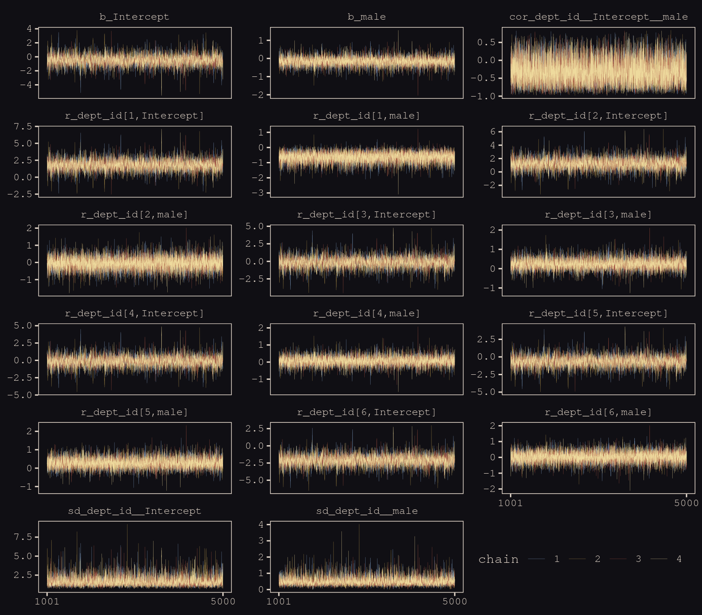

Our chains look great. While we're at it, let's examine the $\hat{R}$ vales in a handmade plot, too.


```r
rhat(b13.3) %>% 
  data.frame() %>% 
  rownames_to_column() %>% 
  set_names("parameter", "rhat") %>% 
  filter(parameter != "lp__") %>% 
  
  ggplot(aes(x = rhat, y = reorder(parameter, rhat))) + 
  geom_segment(aes(xend = 1, yend = parameter),
               color = "#EEDA9D") +
  geom_point(aes(color = rhat > 1), 
             size = 2) +
  scale_color_manual(values = c("#80A0C7", "#A65141")) +
  labs(x = NULL, y = NULL) +
  theme_pearl_earring +
  theme(legend.position = "none",
        axis.ticks.y    = element_blank(),
        axis.text.y     = element_text(hjust = 0))
```

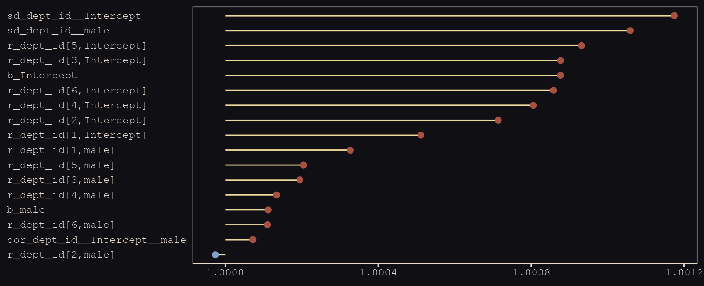

Them are some respectable $\hat{R}$ values. The plot accentuates their differences, but they’re all basically 1 (e.g., see what happens is you set `coord_cartesian(xlim = c(0.99, 1.01))`). Here are the random effects in the **centered** metric:


```r
coef(b13.3)
```

```
## $dept_id
## , , Intercept
## 
##     Estimate  Est.Error        Q2.5      Q97.5
## 1  1.2997054 0.25696449  0.80211049  1.8160258
## 2  0.7374013 0.33068668  0.09348209  1.4105884
## 3 -0.6456650 0.08550191 -0.81546958 -0.4814419
## 4 -0.6184620 0.10503486 -0.82668160 -0.4137505
## 5 -1.1324600 0.11601956 -1.36503108 -0.9069383
## 6 -2.6015706 0.20268140 -3.01268421 -2.2139207
## 
## , , male
## 
##      Estimate Est.Error       Q2.5      Q97.5
## 1 -0.78674874 0.2707370 -1.3231027 -0.2616853
## 2 -0.20647250 0.3316969 -0.8856595  0.4452435
## 3  0.08070568 0.1401311 -0.1875375  0.3616676
## 4 -0.09209919 0.1413379 -0.3682070  0.1845360
## 5  0.12099722 0.1886615 -0.2409682  0.4978260
## 6 -0.12376542 0.2716941 -0.6674311  0.4057879
```

We may as well keep our doing-things-by-hand kick going. Instead relying on `bayesplog::mcmc_intervals()` or `tidybayes::pointintervalh()` to make our coefficient plot, we’ll combine `geom_pointrange()` and `coord_flip()`. But we will need to wrangle a bit to get those brms-based **centered** random effects into a usefully-formatted tidy tibble.


```r
# as far as I can tell, because `coef()` yields a list, you have to take out the two 
# random effects one at a time and then bind them together to get them ready for a tibble
rbind(coef(b13.3)$dept_id[, , 1],
      coef(b13.3)$dept_id[, , 2]) %>% 
  as_tibble() %>% 
  mutate(param   = c(paste("Intercept", 1:6), paste("male", 1:6)),
         reorder = c(6:1, 12:7)) %>% 

  # plot
  ggplot(aes(x = reorder(param, reorder))) +
  geom_hline(yintercept = 0, linetype = 3, color = "#8B9DAF") +
  geom_pointrange(aes(ymin = Q2.5, ymax = Q97.5, y = Estimate, color = reorder < 7),
                  shape = 20, size = 3/4) +
  scale_color_manual(values = c("#394165", "#A65141")) +
  xlab(NULL) +
  coord_flip() +
  theme_pearl_earring +
  theme(legend.position = "none",
        axis.ticks.y    = element_blank(),
        axis.text.y     = element_text(hjust = 0))
```

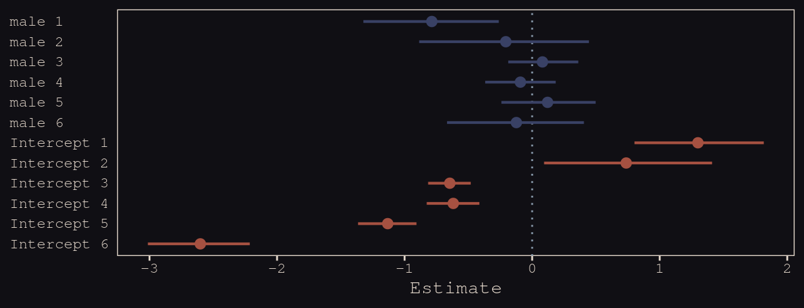

Just like in the text, our `male` slopes are much less dispersed than our intercepts.

### Shrinkage.

Figure 13.6.a depicts the correlation between the full UCB model's varying intercepts and slopes.


```r
library(tidybayes)

post <- posterior_samples(b13.3)

post %>% 
  ggplot(aes(x = cor_dept_id__Intercept__male, y = 0)) +
  geom_halfeyeh(fill = "#394165", color = "#8B9DAF", 
                point_interval = median_qi, .width = .95) +
  scale_x_continuous(breaks = c(-1, median(post$cor_dept_id__Intercept__male), 1),
                     labels = c(-1, "-.35", 1)) +
  scale_y_continuous(NULL, breaks = NULL) +
  coord_cartesian(xlim = -1:1) +
  labs(subtitle = "The dot is at the median; the\nhorizontal bar is the 95% CI.",
       x = "correlation") +
  theme_pearl_earring
```

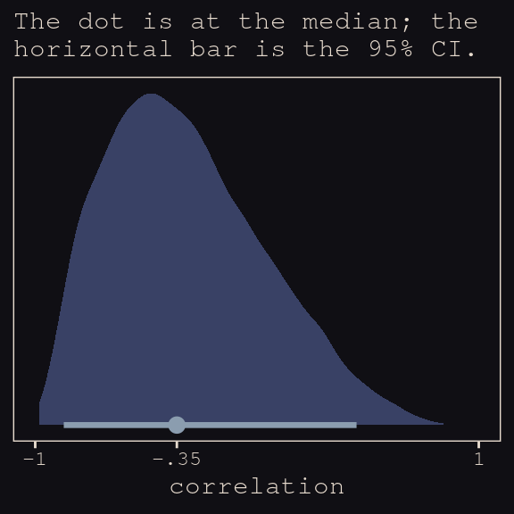

Much like for Figure 13.5.b, above, it'll take a little data processing before we're ready to reproduce Figure 13.6.b. 


```r
# here we put the partially-pooled estimate summaries in a tibble
partially_pooled_params <-
  coef(b13.3)$dept_id[ , 1, ] %>%
  as_tibble() %>%
  set_names("intercept", "slope") %>%
  mutate(dept = 1:n()) %>%
  select(dept, everything())

# in order to calculate the unpooled estimates from the data, we'll need a function that 
# can convert probabilities into the logit metric. if you do the algebra, this is just
# a transformation of the `inv_logit_scaled()` function.
prob_to_logit <- function(x){
  -log((1 / x) -1)
  }

# compute unpooled estimates directly from data
un_pooled_params <-
  d %>%
  group_by(male, dept_id) %>%
  summarise(prob_admit = mean(admit / applications)) %>%
  ungroup() %>%
  mutate(male = ifelse(male == 0, "intercept", "slope")) %>%
  spread(key  = male, value = prob_admit) %>%
  rename(dept = dept_id) %>%
  # here we put our `prob_to_logit()` function to work
  mutate(intercept = prob_to_logit(intercept),
         slope     = prob_to_logit(slope)) %>%
  mutate(slope     = slope - intercept)

# here we combine the partially-pooled and unpooled means into a single data object
params <-
  bind_rows(partially_pooled_params, un_pooled_params) %>%
  mutate(pooled      = rep(c("partially", "not"), each = n() / 2)) %>%
  mutate(dept_letter = rep(LETTERS[1:6], times = 2))  # this will help with plotting

params
```

```
## # A tibble: 12 x 5
##     dept intercept   slope pooled    dept_letter
##    <int>     <dbl>   <dbl> <chr>     <chr>      
##  1     1     1.30  -0.787  partially A          
##  2     2     0.737 -0.206  partially B          
##  3     3    -0.646  0.0807 partially C          
##  4     4    -0.618 -0.0921 partially D          
##  5     5    -1.13   0.121  partially E          
##  6     6    -2.60  -0.124  partially F          
##  7     1     1.54  -1.05   not       A          
##  8     2     0.754 -0.220  not       B          
##  9     3    -0.660  0.125  not       C          
## 10     4    -0.622 -0.0820 not       D          
## 11     5    -1.16   0.200  not       E          
## 12     6    -2.58  -0.189  not       F
```

Here's our version of Figure 13.6.b, depicting two-dimensional shrinkage for the partially-pooled multilevel estimates (posterior means) relative to the unpooled coefficients, calculated from the data. The `ggrepel::geom_text_repel()` function will help us with the in-plot labels.


```r
library(ggrepel)

ggplot(data = params, aes(x = intercept, y = slope)) +
  mapply(function(level){
    stat_ellipse(geom  = "polygon", type = "norm",
                 size  = 0, alpha = 1/20, fill = "#E7CDC2",
                 level = level)
    },  
    level = c(seq(from = 1/10, to = 9/10, by = 1/10), .99)) +
  geom_point(aes(group = dept, color = pooled)) +
  geom_line(aes(group = dept), size = 1/4) +
  scale_color_manual("Pooled?",
                     values = c("#80A0C7", "#A65141")) +
  geom_text_repel(data = params %>% filter(pooled == "partially"),
                  aes(label = dept_letter),
                  color = "#E8DCCF", size = 4, family = "Courier", seed = 13.6) +
  coord_cartesian(xlim = range(params$intercept),
                  ylim = range(params$slope)) +
  labs(x = expression(paste("intercept (", alpha[dept_id], ")")),
       y = expression(paste("slope (", beta[dept_id], ")"))) +
  theme_pearl_earring
```

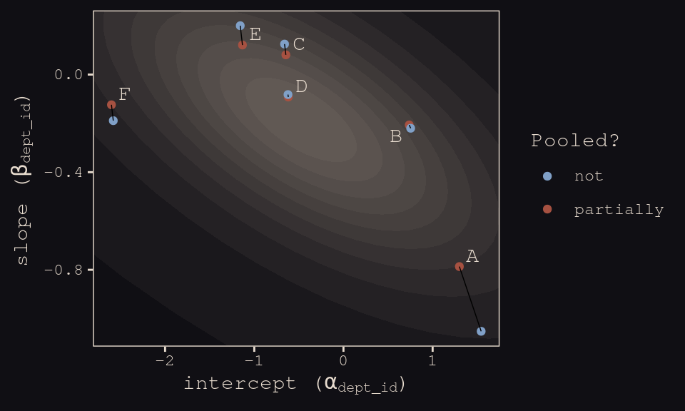

### Model comparison.

Fit the no-gender model.


```r
b13.4 <- 
  brm(data = d, family = binomial,
      admit | trials(applications) ~ 1 + (1 | dept_id),
      prior = c(prior(normal(0, 10), class = Intercept),
                prior(cauchy(0, 2), class = sd)),
      iter = 5000, warmup = 1000, chains = 4, cores = 4,
      seed = 13,
      control = list(adapt_delta = .99,
                     max_treedepth = 12))
```

Compare the three models by the WAIC.


```r
b13.2 <- add_criterion(b13.2, "waic")
b13.3 <- add_criterion(b13.3, "waic")
b13.4 <- add_criterion(b13.4, "waic")

loo_compare(b13.2, b13.3, b13.4, criterion = "waic") %>% 
  print(simplify = F)
```

```
##       elpd_diff se_diff elpd_waic se_elpd_waic p_waic se_p_waic waic  se_waic
## b13.3   0.0       0.0   -45.7       2.4          7.0    1.4      91.4   4.7  
## b13.4  -6.8       7.5   -52.5       9.0          6.5    2.3     105.1  18.1  
## b13.2  -8.5       6.6   -54.2       8.2          9.3    3.0     108.4  16.5
```

In terms of the WAIC estimates and $\text{elpd}$ differences, the models are similar. The story changes when we look at the WAIC weights.


```r
model_weights(b13.2, b13.3, b13.4, weights = "waic") %>% 
  round(digits = 3)
```

```
## b13.2 b13.3 b13.4 
## 0.000 0.999 0.001
```

> The varying slopes model, [`b13.3`], dominates [the other two]. This is despite the fact that the *average* slope in [`b13.3`] is nearly zero. The average isn’t what matters, however. It is the individual slopes, one for each department, that matter. If we wish to generalize to new departments, the variation in slopes suggest that it’ll be worth paying attention to gender, even if the average slope is nearly zero in the population. (pp. 402--403, *emphasis* in the original)

## Example: Cross-classified `chimpanzees` with varying slopes

Retrieve the `chimpanzees` data.


```r
library(rethinking)
data(chimpanzees)
d <- chimpanzees
```


```r
detach(package:rethinking, unload = T)
library(brms)
rm(chimpanzees)

d <-
  d %>%
  select(-recipient) %>%
  mutate(block_id = block)
```

My math's aren't the best. But if I'm following along correctly, here's a fuller statistical expression of our cross-classified model.

\begin{align*}
\text{pulled_left}_i       & \sim \text{Binomial} (n = 1, p_i) \\
\text{logit} (p_i)         & = \alpha_i + (\beta_{1i} + \beta_{2i} \text{condition}_i) \text{prosoc_left}_i  \\
\alpha_i                   & = \alpha + \alpha_{\text{actor}_i} + \alpha_{\text{block_id}_i} \\
\beta_{1i}                 & = \beta_1 + \beta_{1, \text{actor}_i} + \beta_{1, \text{block_id}_i} \\
\beta_{2i}                 & = \beta_2 + \beta_{2, \text{actor}_i} + \beta_{2, \text{block_id}_i} \\
\begin{bmatrix} \alpha_\text{actor} \\ \beta_{1, \text{actor}} \\ \beta_{2, \text{actor}} \end{bmatrix} & \sim \text{MVNormal} \begin{pmatrix} \begin{bmatrix}0 \\ 0 \\ 0 \end{bmatrix} , \mathbf{S}_\text{actor} \end{pmatrix} \\
\begin{bmatrix} \alpha_\text{block_id} \\ \beta_{1, \text{block_id}} \\ \beta_{2, \text{block_id}} \end{bmatrix} & \sim \text{MVNormal} \begin{pmatrix} \begin{bmatrix}0 \\ 0 \\ 0 \end{bmatrix} , \mathbf{S}_\text{block_id} \end{pmatrix} \\
\mathbf S_\text{actor}     & = \begin{pmatrix} \sigma_{\alpha_\text{actor}} & 0 & 0 \\ 0 & \sigma_{\beta_{1_\text{actor}}} & 0 \\ 0 & 0 & \sigma_{\beta_{2_\text{actor}}} \end{pmatrix} 
\mathbf R_\text{actor} \begin{pmatrix} \sigma_{\alpha_\text{actor}} & 0 & 0 \\ 0 & \sigma_{\beta_{1_\text{actor}}} & 0 \\ 0 & 0 & \sigma_{\beta_{2_\text{actor}}} \end{pmatrix} \\
\mathbf S_\text{block_id}  & = \begin{pmatrix} \sigma_{\alpha_\text{block_id}} & 0 & 0 \\ 0 & \sigma_{\beta_{1_\text{block_id}}} & 0 \\ 0 & 0 & \sigma_{\beta_{2_\text{block_id}}} \end{pmatrix} 
\mathbf R_\text{block_id} \begin{pmatrix} \sigma_{\alpha_\text{block_id}} & 0 & 0 \\ 0 & \sigma_{\beta_{1_\text{block_id}}} & 0 \\ 0 & 0 & \sigma_{\beta_{2_\text{block_id}}} \end{pmatrix} \\
\alpha                     & \sim \text{Normal} (0, 1) \\
\beta_1                    & \sim \text{Normal} (0, 1) \\
\beta_2                    & \sim \text{Normal} (0, 1) \\
(\sigma_{\alpha_\text{actor}}, \sigma_{\beta_{1_\text{actor}}}, \sigma_{\beta_{2_\text{actor}}}) & \sim \text{HalfCauchy} (0, 2) \\
(\sigma_{\alpha_\text{block_id}}, \sigma_{\beta_{1_\text{block_id}}}, \sigma_{\beta_{2_\text{block_id}}}) & \sim \text{HalfCauchy} (0, 2) \\
\mathbf R_\text{actor}     & \sim \text{LKJcorr} (4) \\
\mathbf R_\text{block_id}  & \sim \text{LKJcorr} (4)
\end{align*}

And now each $\mathbf R$ is a $3 \times 3$ correlation matrix.

Let’s fit this beast.


```r
b13.6 <- 
  brm(data = d, family = binomial,
      pulled_left | trials(1) ~ 1 + prosoc_left + condition:prosoc_left +
        (1 + prosoc_left + condition:prosoc_left | actor) +
        (1 + prosoc_left + condition:prosoc_left | block_id),
      prior = c(prior(normal(0, 1), class = Intercept),
                prior(normal(0, 1), class = b),
                prior(cauchy(0, 2), class = sd),
                prior(lkj(4), class = cor)),
      iter = 5000, warmup = 1000, chains = 3, cores = 3,
      seed = 13)
```

Even though it's not apparent in the syntax, our model `b13.6` was already fit using the [non-centered parameterization. Behind the scenes, Bürkner has brms do this automatically](https://github.com/paul-buerkner/brms/issues/211). It's been that way all along. 

If you recall from last chapter, we can compute the number of effective samples for our parameters like so.


```r
ratios_cp <- neff_ratio(b13.6)

neff <-
  ratios_cp %>% 
  as_tibble %>% 
  rename(neff_ratio = value) %>% 
  mutate(neff       = neff_ratio * 12000)

head(neff)
```

```
## # A tibble: 6 x 2
##   neff_ratio  neff
##        <dbl> <dbl>
## 1      0.235 2816.
## 2      0.582 6982.
## 3      0.576 6913.
## 4      0.328 3940.
## 5      0.493 5921.
## 6      0.501 6009.
```

Now we're ready for our variant of Figure 13.7. The handy [ggbeeswarm package](https://cran.r-project.org/web/packages/ggbeeswarm/index.html) and its `geom_quasirandom()` function will give a better sense of the distribution.


```r
library(ggbeeswarm)

neff %>%
  ggplot(aes(x = factor(0), y = neff)) +
  geom_boxplot(fill = "#394165", color = "#8B9DAF") +
  geom_quasirandom(method = "tukeyDense",
                   size = 2/3, color = "#EEDA9D", alpha = 2/3) +
  scale_x_discrete(NULL, breaks = NULL,
                   expand = c(.75, .75)) +
  scale_y_continuous(breaks = c(0, 6000, 12000)) +
  coord_cartesian(ylim = 0:12000) +
  labs(y = "effective samples",
       subtitle = "The non-centered\nparameterization is the\nbrms default. No fancy\ncoding required.") +
  theme_pearl_earring
```

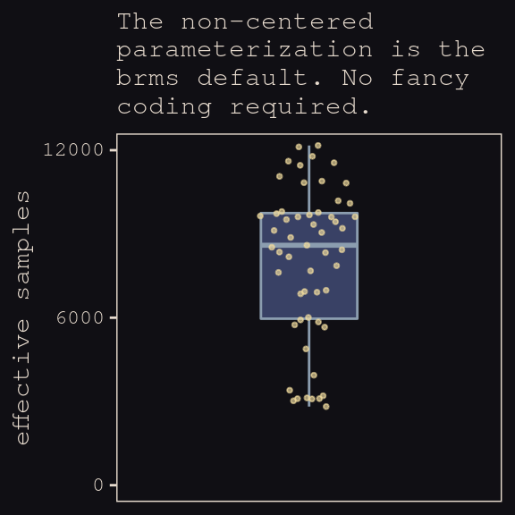

As in the last chapter, we'll use the `bayesplot::mcmc_neff()` function to examine the ratio of n.eff and the fill number of post-warm-up iterations, $N$. Ideally, that ratio is closer to 1 than not.


```r
library(bayesplot)

color_scheme_set(c("#DCA258", "#EEDA9D", "#394165", "#8B9DAF", "#A65141", "#A65141"))

mcmc_neff(ratios_cp, size = 2) +
  theme_pearl_earring
```

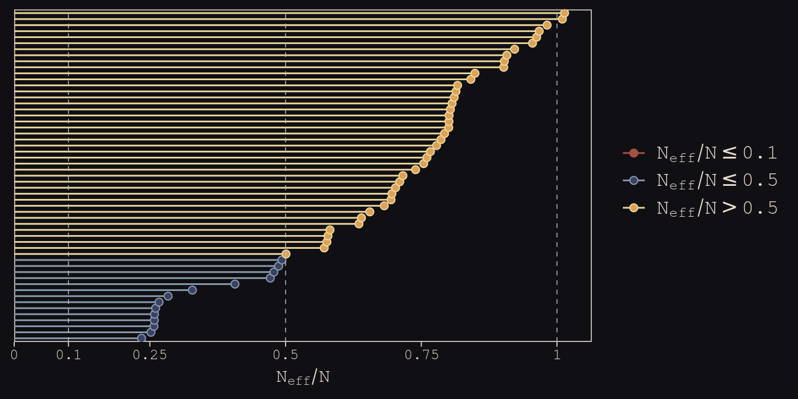

Here are our standard deviation parameters.


```r
tidy(b13.6) %>%
  filter(str_detect(term , "sd_")) %>%
  mutate_if(is.numeric, round, digits = 2)
```

```
##                                 term estimate std.error lower upper
## 1                sd_actor__Intercept     2.33      0.88  1.30  3.94
## 2              sd_actor__prosoc_left     0.46      0.37  0.04  1.14
## 3    sd_actor__prosoc_left:condition     0.52      0.48  0.03  1.46
## 4             sd_block_id__Intercept     0.23      0.21  0.01  0.62
## 5           sd_block_id__prosoc_left     0.56      0.41  0.06  1.31
## 6 sd_block_id__prosoc_left:condition     0.51      0.42  0.04  1.29
```

McElreath discussed `rethinking::link()` in the middle of page 407. He showed how his `link(m13.6NC)` code returned a list of four matrices, of which the `p` matrix was of primary interest. The `brms::fitted()` function doesn't work quite the same way, here.


```r
fitted(b13.6,
       summary = F,
       nsamples = 1000) %>% 
  str()
```

```
##  num [1:1000, 1:504] 0.32 0.359 0.503 0.262 0.331 ...
```

First off, recall that `fitted()` returns summary values, by default. If we want individual values, set `summary = FALSE`. It's also the `fitted()` default to use all posterior iterations, which is 12,000 in this case. To match the text, we need to set `nsamples = 1000`. But those are just details. The main point is that `fitted()` only returns one matrix, which is the analogue to the `p` matrix in the text.

Moving forward, before we can follow along with McElreath’s R code 13.27, we need to refit the simpler model from way back in Chapter 12.


```r
b12.5 <- 
  brm(data = d, family = binomial,
      pulled_left | trials(1) ~ 1 + prosoc_left + condition:prosoc_left + 
        (1 | actor) + (1 | block_id),
      prior = c(prior(normal(0, 10), class = Intercept),
                prior(normal(0, 10), class = b),
                prior(cauchy(0, 1), class = sd)),
      iter = 5000, warmup = 1000, chains = 3, cores = 3,
      seed = 13)
```

Now we can compare them by the WAIC.


```r
b13.6 <- add_criterion(b13.6, "waic")
b12.5 <- add_criterion(b12.5, "waic")

loo_compare(b13.6, b12.5, criterion = "waic") %>% 
  print(simplify = F)
```

```
##       elpd_diff se_diff elpd_waic se_elpd_waic p_waic se_p_waic waic   se_waic
## b12.5    0.0       0.0  -266.3       9.8         10.3    0.5     532.5   19.7 
## b13.6   -1.2       2.0  -267.5       9.9         18.4    0.9     535.0   19.9
```


```r
model_weights(b13.6, b12.5, weights = "waic")
```

```
##    b13.6    b12.5 
## 0.224034 0.775966
```

> In this example, no matter which varying effect structure you use, you’ll find that actors vary a lot in their baseline preference for the left-hand lever. Everything else is much less important. But using the most complex model, [`b13.6`], tells the correct story. Because the varying slopes are adaptively regularized, the model hasn’t overfit much, relative to the simpler model that contains only the important intercept variation. (p. 408)

## Continuous categories and the Gaussian process

> There is a way to apply the varying effects approach to continuous categories… The general approach is known as Gaussian process regression. This name is unfortunately wholly uninformative about what it is for and how it works.
>
We’ll proceed to work through a basic example that demonstrates both what it is for and how it works. The general purpose is to define some dimension along which cases differ. This might be individual differences in age. Or it could be differences in location. Then we measure the distance between each pair of cases. What the model then does is estimate a function for the covariance between pairs of cases at different distances. This covariance function provides one continuous category generalization of the varying effects approach. (p. 410)

### Example: Spatial autocorrelation in Oceanic tools.


```r
# load the distance matrix
library(rethinking)
data(islandsDistMatrix)

# display short column names, so fits on screen
d_mat <- islandsDistMatrix
colnames(d_mat) <- c("Ml", "Ti", "SC", "Ya", "Fi", 
                     "Tr", "Ch", "Mn", "To", "Ha")
round(d_mat, 1)
```

```
##             Ml  Ti  SC  Ya  Fi  Tr  Ch  Mn  To  Ha
## Malekula   0.0 0.5 0.6 4.4 1.2 2.0 3.2 2.8 1.9 5.7
## Tikopia    0.5 0.0 0.3 4.2 1.2 2.0 2.9 2.7 2.0 5.3
## Santa Cruz 0.6 0.3 0.0 3.9 1.6 1.7 2.6 2.4 2.3 5.4
## Yap        4.4 4.2 3.9 0.0 5.4 2.5 1.6 1.6 6.1 7.2
## Lau Fiji   1.2 1.2 1.6 5.4 0.0 3.2 4.0 3.9 0.8 4.9
## Trobriand  2.0 2.0 1.7 2.5 3.2 0.0 1.8 0.8 3.9 6.7
## Chuuk      3.2 2.9 2.6 1.6 4.0 1.8 0.0 1.2 4.8 5.8
## Manus      2.8 2.7 2.4 1.6 3.9 0.8 1.2 0.0 4.6 6.7
## Tonga      1.9 2.0 2.3 6.1 0.8 3.9 4.8 4.6 0.0 5.0
## Hawaii     5.7 5.3 5.4 7.2 4.9 6.7 5.8 6.7 5.0 0.0
```

If you wanted to use color to more effectively visualize the values in the matirx, you might do something like this.


```r
d_mat %>%
  as_tibble() %>%
  gather() %>%
  rename(column = key,
         distance = value) %>%
  mutate(row          = rep(rownames(d_mat), times = 10),
         row_order    = rep(9:0,            times = 10),
         column_order = rep(0:9,            each  = 10)) %>%
  
  ggplot(aes(x = reorder(column, column_order), 
             y = reorder(row,    row_order))) + 
  geom_raster(aes(fill = distance)) + 
  geom_text(aes(label = round(distance, digits = 1)),
            size = 3, family = "Courier", color = "#100F14") +
  scale_fill_gradient(low = "#FCF9F0", high = "#A65141") +
  scale_x_discrete(NULL, position = "top", expand = c(0, 0)) +
  scale_y_discrete(NULL, expand = c(0, 0)) +
  theme_pearl_earring +
  theme(axis.ticks  = element_blank(),
        axis.text.y = element_text(hjust = 0))
```

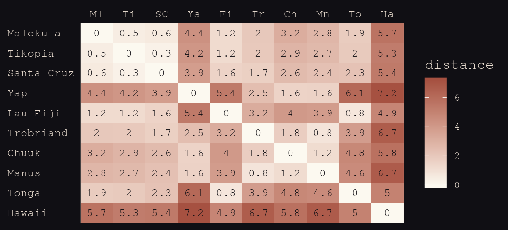

Figure 13.8 shows the "shape of the function relating distance to the covariance $\mathbf{K}_{ij}$."
 

```r
tibble(
  x       = seq(from = 0, to = 4, by = .01),
  linear  = exp(-1 * x),
  squared = exp(-1 * x^2)) %>%
  
  ggplot(aes(x = x)) +
  geom_line(aes(y = linear),
            color = "#B1934A", linetype = 2) +
  geom_line(aes(y = squared),
            color = "#DCA258") +
  scale_x_continuous("distance", expand = c(0, 0)) +
  scale_y_continuous("correlation", 
                     breaks = c(0, .5, 1),
                     labels = c(0, ".5", 1)) +
  theme_pearl_earring
```

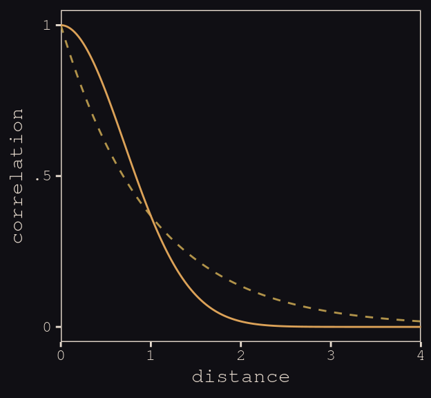

Load the data.


```r
data(Kline2) # load the ordinary data, now with coordinates

d <- 
  Kline2 %>%
  mutate(society = 1:10)

rm(Kline2)

d %>% glimpse()
```

```
## Observations: 10
## Variables: 10
## $ culture     <fct> Malekula, Tikopia, Santa Cruz, Yap, Lau Fiji, Trobriand, Chuuk, Manus, Tonga,…
## $ population  <int> 1100, 1500, 3600, 4791, 7400, 8000, 9200, 13000, 17500, 275000
## $ contact     <fct> low, low, low, high, high, high, high, low, high, low
## $ total_tools <int> 13, 22, 24, 43, 33, 19, 40, 28, 55, 71
## $ mean_TU     <dbl> 3.2, 4.7, 4.0, 5.0, 5.0, 4.0, 3.8, 6.6, 5.4, 6.6
## $ lat         <dbl> -16.3, -12.3, -10.7, 9.5, -17.7, -8.7, 7.4, -2.1, -21.2, 19.9
## $ lon         <dbl> 167.5, 168.8, 166.0, 138.1, 178.1, 150.9, 151.6, 146.9, -175.2, -155.6
## $ lon2        <dbl> -12.5, -11.2, -14.0, -41.9, -1.9, -29.1, -28.4, -33.1, 4.8, 24.4
## $ logpop      <dbl> 7.003065, 7.313220, 8.188689, 8.474494, 8.909235, 8.987197, 9.126959, 9.47270…
## $ society     <int> 1, 2, 3, 4, 5, 6, 7, 8, 9, 10
```

Switch out rethinking for brms.


```r
detach(package:rethinking, unload = T)
library(brms)
```

Okay, it appears this is going to be a bit of a ride. It's not entirely clear to me if we can fit a Gaussian process model in brms that's a direct equivalent to what McElreath did with rethinking. But we can try. First, note our use of the `gp()` syntax in the `brm()` function, below. We're attempting to tell brms that we would like to include latitude and longitude (i.e., `lat` and `long2`, respectively) in a Gaussian process. Also note how our priors are a little different than those in the text. I'll explain, below. Let's just move ahead and fit the model.


```r
b13.7 <- 
  brm(data = d, family = poisson,
      total_tools ~ 1 + gp(lat, lon2) + logpop,
      prior = c(prior(normal(0, 10), class = Intercept),
                prior(normal(0, 1), class = b),
                prior(inv_gamma(2.874624, 0.393695), class = lscale),
                prior(cauchy(0, 1), class = sdgp)),
      iter = 1e4, warmup = 2000, chains = 4, cores = 4,
      seed = 13,
      control = list(adapt_delta = 0.999,
                     max_treedepth = 12))
```

Here's the model summary.


```r
posterior_summary(b13.7) %>%
  round(digits = 2)
```

```
##                   Estimate Est.Error   Q2.5  Q97.5
## b_Intercept           1.45      1.12  -0.78   3.77
## b_logpop              0.23      0.11   0.02   0.45
## sdgp_gplatlon2        0.52      0.36   0.16   1.47
## lscale_gplatlon2      0.23      0.13   0.07   0.56
## zgp_gplatlon2[1]     -0.60      0.79  -2.16   0.94
## zgp_gplatlon2[2]      0.44      0.85  -1.25   2.09
## zgp_gplatlon2[3]     -0.63      0.70  -1.97   0.91
## zgp_gplatlon2[4]      0.88      0.70  -0.45   2.29
## zgp_gplatlon2[5]      0.25      0.75  -1.23   1.73
## zgp_gplatlon2[6]     -1.00      0.79  -2.56   0.60
## zgp_gplatlon2[7]      0.13      0.72  -1.40   1.53
## zgp_gplatlon2[8]     -0.18      0.88  -1.90   1.59
## zgp_gplatlon2[9]      0.41      0.92  -1.49   2.14
## zgp_gplatlon2[10]    -0.31      0.82  -1.93   1.28
## lp__                -51.50      3.18 -58.69 -46.33
```

Our Gaussian process parameters are different than McElreath's. From the brms reference manual, here's the brms parameterization:

$$k(x_{i},x_{j}) = sdgp^2 \text{exp} \big (-||x_i - x_j||^2 / (2 lscale^2) \big )$$

What McElreath called $\eta$, Bürkner called $sdgp$. While McElreath estimated $\eta^2$, brms simply estimated $sdgp$. So we'll have to square our `sdgp_gplatlon2` before it's on the same scale as `etasq` in the text. Here it is.


```r
posterior_samples(b13.7) %>% 
  transmute(sdgp_squared = sdgp_gplatlon2^2) %>% 
  mean_hdi(sdgp_squared, .width = .89) %>% 
  mutate_if(is.double, round, digits = 3)
```

```
##   sdgp_squared .lower .upper .width .point .interval
## 1        0.407      0  0.761   0.89   mean       hdi
```

Now we're in the ballpark. In our model `brm()` code, above, we just went with the flow and kept the `cauchy(0, 1)` prior on `sdgp`.

Now look at the denominator of the inner part of Bürkner equation, $2 lscale^2$. This appears to be the brms equivalent to McElreath's $\rho^2$. Or at least it's what we've got. Anyway, also note that McElreath estimated $\rho^2$ directly as `rhosq`. If I'm doing the algebra correctly--and that may well be a big if--, we might expect: 

$$\rho^2 = 1/(2 \cdot lscale^2)$$

But that doesn't appear to be the case. *Sigh*. 


```r
posterior_samples(b13.7) %>% 
  transmute(rho_squared = 1 / (2 * lscale_gplatlon2^2)) %>% 
  mean_hdi(rho_squared, .width = .89) %>% 
  mutate_if(is.double, round, digits = 3)
```

```
##   rho_squared .lower .upper .width .point .interval
## 1      21.829  0.433 47.516   0.89   mean       hdi
```

Oh man, that isn't even close to the 2.67 McElreath reported in the text. The plot deepens. If you look back, you'll see we used a very different prior for $lscale$. Here is it: `inv_gamma(2.874624, 0.393695)`. Use `get_prior()` to discover where that came from.


```r
get_prior(data = d, family = poisson,
          total_tools ~ 1 + gp(lat, lon2) + logpop)
```

```
##                           prior     class      coef group resp dpar nlpar bound
## 1                                       b                                      
## 2                                       b    logpop                            
## 3           student_t(3, 3, 10) Intercept                                      
## 4                normal(0, 0.5)    lscale                                      
## 5 inv_gamma(2.874624, 0.393695)    lscale gplatlon2                            
## 6           student_t(3, 0, 10)      sdgp                                      
## 7                                    sdgp gplatlon2
```

That is, we used the brms default prior for $lscale$. In a [GitHub exchange](https://github.com/ASKurz/Statistical_Rethinking_with_brms_ggplot2_and_the_tidyverse/issues/8), Bürkner pointed out that brms uses special priors for $lscale$ parameters based on [Michael Betancourt](https://twitter.com/betanalpha) [of the Stan team]'s [vignette on the topic](https://betanalpha.github.io/assets/case_studies/gp_part3/part3.html). Though it isn't included in this document, I also ran the model with the `cauchy(0, 1)` prior and the results were quite similar. So the big discrepancy between our model and the one in the text isn't based on that prior.

Now that we’ve hopped on the comparison train, we may as well keep going down the track. Let’s reproduce McElreath’s model with rethinking. 

Switch out brms for rethinking.


```r
detach(package:brms, unload = T)
library(rethinking)
```

Now fit the `rethinking::map2stan()` model.


```r
m13.7 <- map2stan(
    alist(
        total_tools ~ dpois(lambda),
        log(lambda) <- a + g[society] + bp*logpop,
        g[society] ~ GPL2( Dmat , etasq , rhosq , 0.01 ),
        a ~ dnorm(0,10),
        bp ~ dnorm(0,1),
        etasq ~ dcauchy(0,1),
        rhosq ~ dcauchy(0,1)
    ),
    data=list(
        total_tools=d$total_tools,
        logpop=d$logpop,
        society=d$society,
        Dmat=islandsDistMatrix),
    warmup=2000 , iter=1e4 , chains=4)
```

Alright, now we'll work directly with the posteriors to make some visual comparisons.


```r
# rethinking-based posterior
post_m13.7 <- rethinking::extract.samples(m13.7)[2:5] %>% as_tibble()

detach(package:rethinking, unload = T)
library(brms)

# brms-based posterior
post_b13.7 <- posterior_samples(b13.7)
```

Here's the model intercept posterior, by package.


```r
post_m13.7[, "a"] %>% 
  bind_rows(post_b13.7%>% 
              transmute(a = b_Intercept)) %>% 
  mutate(package = rep(c("rethinking", "brms"), each = nrow(post_m13.7))) %>% 
  
  ggplot(aes(x = a, fill = package)) +
  geom_density(size = 0, alpha = 1/2) +
  scale_fill_manual(NULL, values = c("#80A0C7", "#A65141")) +
  scale_y_continuous(NULL, breaks = NULL) +
  labs(title = "Not identical, but pretty close",
       x     = "intercept") +
  theme_pearl_earring
```

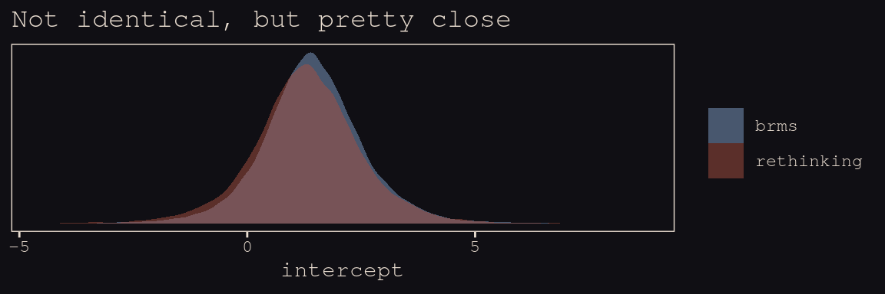

Now check the slopes.


```r
post_m13.7[, "bp"] %>% 
  bind_rows(post_b13.7 %>% 
              transmute(bp = b_logpop)
              ) %>% 
  mutate(package = rep(c("rethinking", "brms"), each = nrow(post_m13.7))) %>% 
  
  ggplot(aes(x = bp, fill = package)) +
  geom_density(size = 0, alpha = 1/2) +
  scale_fill_manual(NULL, values = c("#80A0C7", "#A65141")) +
  scale_y_continuous(NULL, breaks = NULL) +
  labs(title = "Again, pretty close",
       x     = "slope") +
  theme_pearl_earring
```

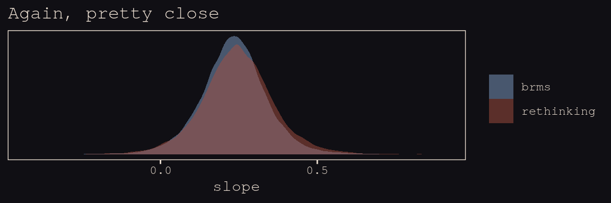

This one, $\eta^2$, required a little transformation.
              

```r
post_m13.7[, "etasq"] %>% 
  bind_rows(post_b13.7 %>% 
              transmute(etasq = sdgp_gplatlon2^2)) %>% 
  mutate(package = rep(c("rethinking", "brms"), each = nrow(post_m13.7))) %>% 
  
  ggplot(aes(x = etasq, fill = package)) +
  geom_density(size = 0, alpha = 1/2) +
  scale_fill_manual(NULL, values = c("#80A0C7", "#A65141")) +
  scale_y_continuous(NULL, breaks = NULL) +
  labs(title = "Still in the same ballpark",
       x     = expression(eta^2)) +
  coord_cartesian(xlim = 0:3) +
  theme_pearl_earring
```

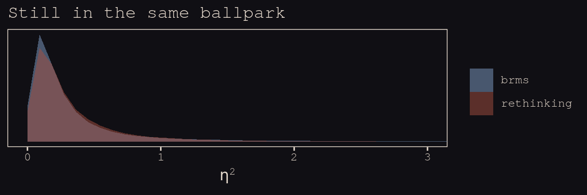

$\rho^2$ required more extensive transformation of the brms posterior:
              

```r
post_m13.7[, "rhosq"] %>%
  bind_rows(post_b13.7%>% 
              transmute(rhosq = 1 / (2 * (lscale_gplatlon2^2)))
            ) %>% 
  mutate(package = rep(c("rethinking", "brms"), each = nrow(post_m13.7))) %>% 
  
  ggplot(aes(x = rhosq, fill = package)) +
  geom_density(size = 0) +
  scale_fill_manual(NULL, values = c("#80A0C7", "#A65141")) +
  labs(title    = "Holy smokes are those not the same!",
       subtitle = "Notice how differently the y axes got scaled. Also, that brms density is\nright skewed for days.",
       x        = expression(rho^2)) +
  coord_cartesian(xlim = 0:50) +
  theme_pearl_earring +
  theme(legend.position = "none") +
  facet_wrap(~package, scales = "free_y")
```

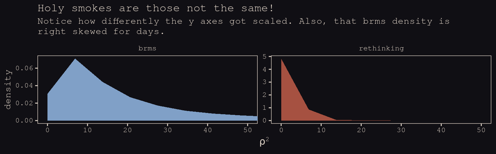

I'm in clinical psychology. Folks in my field don't tend to use Gaussian processes, so getting to the bottom of this is low on my to-do list. Perhaps one of y'all are more experienced with Gaussian processes and see a flaw somewhere in my code. Please [hit me up](https://github.com/ASKurz/Statistical_Rethinking_with_brms_ggplot2_and_the_tidyverse/issues) if you do.

Anyways, here's our brms + ggplot2 version of Figure 13.9.


```r
# for `sample_n()`
set.seed(13)

# wrangle
post_b13.7 %>% 
  transmute(iter  = 1:n(),
            etasq = sdgp_gplatlon2^2,
            rhosq = lscale_gplatlon2^2 * .5) %>% 
  sample_n(100) %>% 
  expand(nesting(iter, etasq, rhosq),
         x = seq(from = 0, to = 55, by = 1)) %>% 
  mutate(covariance = etasq * exp(-rhosq * x^2)) %>% 
  
  # plot
  ggplot(aes(x = x, y = covariance)) +
  geom_line(aes(group = iter),
            size = 1/4, alpha = 1/4, color = "#EEDA9D") +
  stat_function(fun = function(x) median(post_b13.7$sdgp_gplatlon2)^2 *
                  exp(-median(post_b13.7$lscale_gplatlon2)^2 *.5 * x^2),
                color = "#EEDA9D", size = 1.1) +
  scale_x_continuous("distance (thousand km)", expand = c(0, 0),
                     breaks = seq(from = 0, to = 50, by = 10)) +
  coord_cartesian(xlim = 0:50,
                  ylim = 0:1) +
  theme_pearl_earring
```


Do note the scale on which we placed our x axis. Our brms parameterization resulted in a gentler decline in spatial covariance.

Let's finish this up and "push the parameters back through the function for $\mathbf{K}$, the covariance matrix" (p. 415).


```r
# compute posterior median covariance among societies
k <- matrix(0, nrow = 10, ncol = 10)
for (i in 1:10)
    for (j in 1:10)
        k[i, j] <- median(post_b13.7$sdgp_gplatlon2^2) * 
  exp(-median(post_b13.7$lscale_gplatlon2^2) * 
        islandsDistMatrix[i, j]^2)

diag(k) <- median(post_b13.7$sdgp_gplatlon2^2) + 0.01

k %>% round(2)
```

```
##       [,1] [,2] [,3] [,4] [,5] [,6] [,7] [,8] [,9] [,10]
##  [1,] 0.20 0.19 0.19 0.09 0.18 0.16 0.13 0.14 0.16  0.05
##  [2,] 0.19 0.20 0.19 0.09 0.18 0.16 0.13 0.14 0.16  0.06
##  [3,] 0.19 0.19 0.20 0.10 0.17 0.17 0.14 0.15 0.15  0.06
##  [4,] 0.09 0.09 0.10 0.20 0.06 0.15 0.17 0.17 0.04  0.02
##  [5,] 0.18 0.18 0.17 0.06 0.20 0.12 0.10 0.10 0.18  0.07
##  [6,] 0.16 0.16 0.17 0.15 0.12 0.20 0.17 0.18 0.10  0.03
##  [7,] 0.13 0.13 0.14 0.17 0.10 0.17 0.20 0.18 0.07  0.05
##  [8,] 0.14 0.14 0.15 0.17 0.10 0.18 0.18 0.20 0.08  0.03
##  [9,] 0.16 0.16 0.15 0.04 0.18 0.10 0.07 0.08 0.20  0.07
## [10,] 0.05 0.06 0.06 0.02 0.07 0.03 0.05 0.03 0.07  0.20
```

And we'll continue to follow suit and change these to a correlation matrix.


```r
# convert to correlation matrix
rho <- round(cov2cor(k), 2)

# add row/col names for convenience
colnames(rho) <- c("Ml","Ti","SC","Ya","Fi","Tr","Ch","Mn","To","Ha")
rownames(rho) <- colnames(rho)

rho %>% round(2)
```

```
##      Ml   Ti   SC   Ya   Fi   Tr   Ch   Mn   To   Ha
## Ml 1.00 0.94 0.93 0.44 0.89 0.80 0.63 0.69 0.83 0.26
## Ti 0.94 1.00 0.95 0.47 0.89 0.81 0.68 0.71 0.81 0.31
## SC 0.93 0.95 1.00 0.52 0.86 0.84 0.72 0.76 0.77 0.29
## Ya 0.44 0.47 0.52 1.00 0.29 0.74 0.86 0.85 0.21 0.12
## Fi 0.89 0.89 0.86 0.29 1.00 0.62 0.49 0.51 0.93 0.36
## Tr 0.80 0.81 0.84 0.74 0.62 1.00 0.83 0.92 0.51 0.16
## Ch 0.63 0.68 0.72 0.86 0.49 0.83 1.00 0.89 0.37 0.24
## Mn 0.69 0.71 0.76 0.85 0.51 0.92 0.89 1.00 0.40 0.15
## To 0.83 0.81 0.77 0.21 0.93 0.51 0.37 0.40 1.00 0.34
## Ha 0.26 0.31 0.29 0.12 0.36 0.16 0.24 0.15 0.34 1.00
```

The correlations in our `rho` matrix look a little higher than those in the text. Before we get see them in a plot, let's consider `psize`. If you really want to scale the points in Figure 13.10.a like McElreath did, you can make the `psize` variable in a tidyverse sort of way as follows. However, if you compare the `psize` method and the default ggplot2 method using just `logpop`, you'll see the difference is negligible. In that light, I'm going to be lazy and just use `logpop` in my plots.


```r
d %>% 
  transmute(psize = logpop / max(logpop)) %>% 
  transmute(psize = exp(psize * 1.5) - 2)
```

```
##        psize
## 1  0.3134090
## 2  0.4009582
## 3  0.6663711
## 4  0.7592196
## 5  0.9066890
## 6  0.9339560
## 7  0.9834797
## 8  1.1096138
## 9  1.2223112
## 10 2.4816891
```

As far as I can figure, you still have to get `rho` into a tidy data frame before feeding it into ggplot2. Here’s my attempt at doing so.


```r
tidy_rho <-
  rho %>%
  data.frame() %>% 
  rownames_to_column() %>% 
  bind_cols(d %>% select(culture, logpop, total_tools, lon2, lat)) %>% 
  gather(colname, correlation, -rowname, -culture, -logpop, -total_tools, -lon2, -lat) %>% 
  mutate(group = str_c(pmin(rowname, colname), pmax(rowname, colname))) %>%
  select(rowname, colname, group, culture, everything())

head(tidy_rho)
```

```
##   rowname colname group    culture   logpop total_tools  lon2   lat correlation
## 1      Ml      Ml  MlMl   Malekula 7.003065          13 -12.5 -16.3        1.00
## 2      Ti      Ml  MlTi    Tikopia 7.313220          22 -11.2 -12.3        0.94
## 3      SC      Ml  MlSC Santa Cruz 8.188689          24 -14.0 -10.7        0.93
## 4      Ya      Ml  MlYa        Yap 8.474494          43 -41.9   9.5        0.44
## 5      Fi      Ml  FiMl   Lau Fiji 8.909235          33  -1.9 -17.7        0.89
## 6      Tr      Ml  MlTr  Trobriand 8.987197          19 -29.1  -8.7        0.80
```

Okay, here's our version of Figure 13.10.a.


```r
tidy_rho %>%       
  ggplot(aes(x = lon2, y = lat)) +
  geom_line(aes(group = group, alpha = correlation^2),
            color = "#80A0C7") +
  geom_point(data = d, aes(size = logpop), color = "#DCA258") +
  geom_text_repel(data = d, aes(label = culture), 
                  seed = 0, point.padding = .3, size = 3, color = "#FCF9F0") +
  scale_alpha_continuous(range = c(0, 1)) +
  labs(x = "longitude",
       y = "latitude") +
  coord_cartesian(xlim = range(d$lon2),
                  ylim = range(d$lat)) +
  theme(legend.position = "none") +
  theme_pearl_earring 
```

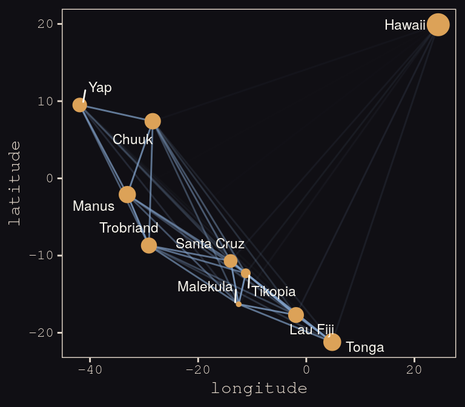

Yep, as expressed by the intensity of the colors of the connecting lines, those correlations are more pronounced than those in the text. Here's our version of Figure 13.10.b.


```r
# new data for `fitted()`
nd <- 
  tibble(logpop = seq(from = 6, to = 14, length.out = 30),
         lat    = median(d$lat),
         lon2   = median(d$lon2))

# `fitted()`
f <-
  fitted(b13.7, newdata = nd) %>% 
  as_tibble() %>% 
  bind_cols(nd)
  
# plot
tidy_rho %>% 
  ggplot(aes(x = logpop)) +
  geom_smooth(data = f,
              aes(y = Estimate, ymin = Q2.5, ymax = Q97.5),
              stat = "identity",
              fill = "#394165", color = "#100F14", alpha = .5, size = 1.1) +
  geom_line(aes(y = total_tools, group = group, alpha = correlation^2),
            color = "#80A0C7") +
  geom_point(data = d, 
             aes(y = total_tools, size = logpop), color = "#DCA258") +
  geom_text_repel(data = d, 
                  aes(y = total_tools, label = culture), 
                  seed = 0, point.padding = .3, size = 3, color = "#FCF9F0") +
  scale_alpha_continuous(range = c(0, 1)) +
  labs(x = "log population",
       y = "total tools") +
  coord_cartesian(xlim = range(d$logpop),
                  ylim = range(d$total_tools)) +
  theme(legend.position = "none") +
  theme_pearl_earring
```

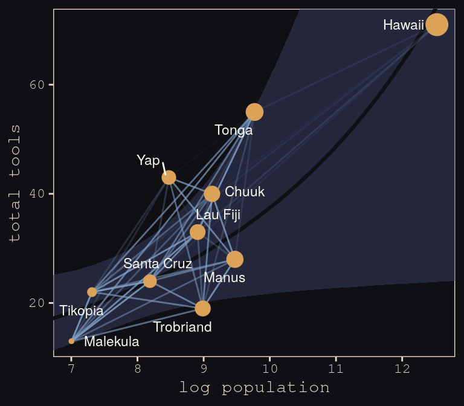

Same deal. Our higher correlations make for a more intensely-webbed plot. To learn more on Bürkner's thoughts on this model in brms, check out the [thread on this issue](https://github.com/paul-buerkner/brms/issues/300).

## ~~Summary~~ Bonus: Another Berkley-admissions-data-like example. 

[McElreath uploaded recordings](https://www.youtube.com/channel/UCNJK6_DZvcMqNSzQdEkzvzA/playlists) of him teaching out of his text for a graduate course during the 2017/2018 fall semester. In the beginning of [lecture 13 from week 7](https://www.youtube.com/watch?v=rSQ1XMwO_9A&t), he discussed a paper from [van der Lee and Ellemers (2015) published an article in PNAS]( http://www.pnas.org/content/112/40/12349.abstract). Their paper suggested male researchers were more likely than female researchers to get research funding in the Netherlands. In their initial analysis (p. 12350) they provided a simple $\chi^2$ test to test the null hypothesis there was no difference in success for male versus female researchers, for which they reported $\chi_{df = 1}^2 = 4.01, p = .045$. Happily, van der Lee and Ellemers provided their data values in their supplemental material (i.e., [Table S1.](http://www.pnas.org/content/suppl/2015/09/16/1510159112.DCSupplemental/pnas.201510159SI.pdf)), which McElreath also displayed in his video. 

Their data follows the same structure as the Berkley admissions data. In his lecture, McElreath suggested their $\chi^2$ test is an example of Simpson’s paradox, just as with the Berkley data. He isn't the first person to raise this criticism (see [Volker and SteenBeek’s critique](http://www.pnas.org/content/112/51/E7036.full), which McElreath also pointed to in the lecture).

Here are the data:


```r
funding <- 
  tibble(
    discipline   = rep(c("Chemical sciences", "Physical sciences", "Physics", "Humanities", 
                         "Technical sciences",  "Interdisciplinary", "Earth/life sciences", 
                         "Social sciences", "Medical sciences"),
                     each = 2),
    gender       = rep(c("m", "f"), times = 9),
    applications = c(83, 39, 135, 39, 67, 9, 230, 166, 189, 62, 105, 78, 156, 126, 425, 409, 245, 260) %>% as.integer(),
    awards       = c(22, 10, 26, 9, 18, 2, 33, 32, 30, 13, 12, 17, 38, 18, 65, 47, 46, 29) %>% as.integer(),
    rejects      = c(61, 29, 109, 30, 49, 7, 197, 134, 159, 49, 93, 61, 118, 108, 360, 362, 199, 231) %>% as.integer(),
    male         = ifelse(gender == "f", 0, 1) %>% as.integer()
  )

funding
```

```
## # A tibble: 18 x 6
##    discipline          gender applications awards rejects  male
##    <chr>               <chr>         <int>  <int>   <int> <int>
##  1 Chemical sciences   m                83     22      61     1
##  2 Chemical sciences   f                39     10      29     0
##  3 Physical sciences   m               135     26     109     1
##  4 Physical sciences   f                39      9      30     0
##  5 Physics             m                67     18      49     1
##  6 Physics             f                 9      2       7     0
##  7 Humanities          m               230     33     197     1
##  8 Humanities          f               166     32     134     0
##  9 Technical sciences  m               189     30     159     1
## 10 Technical sciences  f                62     13      49     0
## 11 Interdisciplinary   m               105     12      93     1
## 12 Interdisciplinary   f                78     17      61     0
## 13 Earth/life sciences m               156     38     118     1
## 14 Earth/life sciences f               126     18     108     0
## 15 Social sciences     m               425     65     360     1
## 16 Social sciences     f               409     47     362     0
## 17 Medical sciences    m               245     46     199     1
## 18 Medical sciences    f               260     29     231     0
```

Let’s fit a few models.

First, we’ll fit an analogue to the initial van der Lee and Ellemers $\chi^2$ test. Since we’re Bayesian modelers, we’ll use a simple logistic regression, using `male` (dummy coded 0 = female, 1 = male) to predict admission (i.e., `awards`).


```r
b13.bonus_0 <- 
  brm(data = funding, family = binomial,
      awards | trials(applications) ~ 1 + male,
      # note our continued use of weakly-regularizing priors
      prior = c(prior(normal(0, 4), class = Intercept),
                prior(normal(0, 4), class = b)),
      iter = 5000, warmup = 1000, chains = 4, cores = 4,
      seed = 13)
```

If you inspect them, the chains look great. Here are the posterior summaries:


```r
tidy(b13.bonus_0) %>%
  filter(term != "lp__") %>%
  mutate_if(is.numeric, round, digits = 2)
```

```
##          term estimate std.error lower upper
## 1 b_Intercept    -1.74      0.08 -1.88 -1.61
## 2      b_male     0.21      0.11  0.04  0.38
```

Yep, the 95% intervals for `male` dummy exclude zero. If you wanted a one-sided Bayesian $p$-value, you might do something like:


```r
posterior_samples(b13.bonus_0) %>%
  summarise(one_sided_Bayesian_p_value = mean(b_male <= 0))
```

```
##   one_sided_Bayesian_p_value
## 1                    0.02225
```

Pretty small. But recall how Simpson's paradox helped us understand the Berkley data. Different departments in Berkley had different acceptance rates AND different ratios of male and female applicants. Similarly, different academic disciplines in the Netherlands might have different `award` rates for funding AND different ratios of male and female applications.

Just like in section 13.2, let's fit two more models. The first model will allow intercepts to vary by discipline. The second model will allow intercepts and the `male` dummy slopes to vary by discipline.


```r
b13.bonus_1 <- 
  brm(data = funding, family = binomial,
      awards | trials(applications) ~ 1 + male + (1 | discipline),
      prior = c(prior(normal(0, 4), class = Intercept),
                prior(normal(0, 4), class = b),
                prior(cauchy(0, 1), class = sd)),
      iter = 5000, warmup = 1000, chains = 4, cores = 4,
      control = list(adapt_delta = .99),
      seed = 13)

b13.bonus_2 <- 
  brm(data = funding, family = binomial,
      awards | trials(applications) ~ 1 + male + (1 + male | discipline),
      prior = c(prior(normal(0, 4), class = Intercept),
                prior(normal(0, 4), class = b),
                prior(cauchy(0, 1), class = sd),
                prior(lkj(4), class = cor)),
      iter = 5000, warmup = 1000, chains = 4, cores = 4,
      control = list(adapt_delta = .99),
      seed = 13)
```

We'll compare the models with information criteria.


```r
b13.bonus_0 <- add_criterion(b13.bonus_0, "waic")
b13.bonus_1 <- add_criterion(b13.bonus_1, "waic")
b13.bonus_2 <- add_criterion(b13.bonus_2, "waic")

loo_compare(b13.bonus_0, b13.bonus_1, b13.bonus_2,
            criterion = "waic") %>% 
  print(simplify = F)
```

```
##             elpd_diff se_diff elpd_waic se_elpd_waic p_waic se_p_waic waic  se_waic
## b13.bonus_2   0.0       0.0   -58.3       2.8          8.8    1.1     116.6   5.6  
## b13.bonus_1  -4.6       1.4   -62.9       3.7         10.1    1.5     125.9   7.3  
## b13.bonus_0  -6.6       2.7   -64.9       4.5          4.8    1.4     129.9   9.0
```

The WAIC suggests the varying intercepts/varying slopes model made the best sense of the data. Here we'll practice our `tidybayes::spread_draws()` skills from the end of the last chapter to see what the random intercepts look like in a coefficient plot.


```r
b13.bonus_2 %>% 
  spread_draws(b_male, r_discipline[discipline,term]) %>% 
  filter(term == "male") %>% 
  ungroup() %>% 
  mutate(effect     = b_male + r_discipline,
         discipline = str_replace(discipline, "[.]", " ")) %>% 
  
  ggplot(aes(x = effect, y = reorder(discipline, effect))) +
  geom_vline(xintercept = 0, color = "#E8DCCF", alpha = 1/2) +
  geom_halfeyeh(.width = .95, size = .9, relative_scale = .9,
                color = "#80A0C7", fill = "#394165") +
  labs(title    = "Random slopes for the male dummy",
       subtitle = "The dots and horizontal lines are the posterior means and percentile-based\n95% intervals, respectively. The values are on the log scale.",
       x        = NULL, y = NULL) +
  coord_cartesian(xlim = c(-1.5, 1.5)) +
  theme_pearl_earring +
  theme(axis.ticks.y = element_blank(),
        axis.text.y  = element_text(hjust = 0))
```

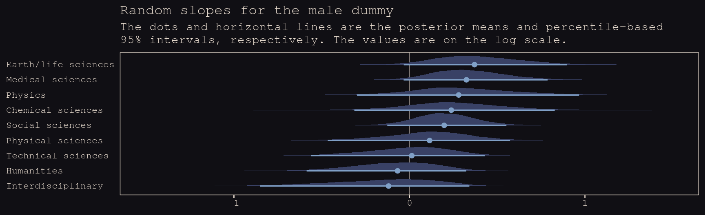

Note how the 95% intervals for all the random `male` slopes contain zero within their bounds. Here are the fixed effects:


```r
tidy(b13.bonus_2) %>%
  filter(str_detect(term , "b_")) %>%
  mutate_if(is.numeric, round, digits = 2)
```

```
##          term estimate std.error lower upper
## 1 b_Intercept    -1.63      0.15 -1.85 -1.38
## 2      b_male     0.15      0.17 -0.14  0.42
```

And if you wanted a one-sided Bayesian $p$-value for the `male` dummy for the full model:


```r
posterior_samples(b13.bonus_2) %>%
  summarise(one_sided_Bayesian_p_value = mean(b_male <= 0))
```

```
##   one_sided_Bayesian_p_value
## 1                  0.1761875
```

So, the estimate of the gender bias is small and consistent with the null hypothesis. Which is good! We want gender equality for things like funding success.

## Reference {-}

[McElreath, R. (2016). *Statistical rethinking: A Bayesian course with examples in R and Stan.* Chapman & Hall/CRC Press.](https://xcelab.net/rm/statistical-rethinking/)

## Session info {-}


```r
sessionInfo()
```

```
## R version 3.6.3 (2020-02-29)
## Platform: x86_64-pc-linux-gnu (64-bit)
## Running under: Debian GNU/Linux 10 (buster)
## 
## Matrix products: default
## BLAS/LAPACK: /usr/lib/x86_64-linux-gnu/libopenblasp-r0.3.5.so
## 
## locale:
##  [1] LC_CTYPE=en_US.UTF-8       LC_NUMERIC=C               LC_TIME=en_US.UTF-8       
##  [4] LC_COLLATE=en_US.UTF-8     LC_MONETARY=en_US.UTF-8    LC_MESSAGES=C             
##  [7] LC_PAPER=en_US.UTF-8       LC_NAME=C                  LC_ADDRESS=C              
## [10] LC_TELEPHONE=C             LC_MEASUREMENT=en_US.UTF-8 LC_IDENTIFICATION=C       
## 
## attached base packages:
## [1] parallel  stats     graphics  grDevices utils     datasets  methods   base     
## 
## other attached packages:
##  [1] rethinking_2.01    brms_2.9.0         bayesplot_1.7.0    ggbeeswarm_0.6.0   ggrepel_0.8.1     
##  [6] tidybayes_1.1.0    broom_0.5.2        Rcpp_1.0.1         dagitty_0.2-2      rstan_2.18.2      
## [11] StanHeaders_2.18.1 dutchmasters_0.1.0 forcats_0.4.0      stringr_1.4.0      dplyr_0.8.1       
## [16] purrr_0.3.2        readr_1.3.1        tidyr_0.8.3        tibble_2.1.3       ggplot2_3.1.1     
## [21] tidyverse_1.2.1   
## 
## loaded via a namespace (and not attached):
##   [1] colorspace_1.4-1          ggridges_0.5.1            rsconnect_0.8.13         
##   [4] ggstance_0.3.1            markdown_1.0              base64enc_0.1-3          
##   [7] rstudioapi_0.10           farver_2.0.3              svUnit_0.7-12            
##  [10] DT_0.7                    fansi_0.4.0               mvtnorm_1.0-10           
##  [13] lubridate_1.7.4           xml2_1.2.0                codetools_0.2-16         
##  [16] bridgesampling_0.6-0      knitr_1.23                shinythemes_1.1.2        
##  [19] zeallot_0.1.0             jsonlite_1.6              shiny_1.3.2              
##  [22] compiler_3.6.3            httr_1.4.0                backports_1.1.4          
##  [25] assertthat_0.2.1          Matrix_1.2-17             lazyeval_0.2.2           
##  [28] cli_1.1.0                 later_0.8.0               htmltools_0.3.6          
##  [31] prettyunits_1.0.2         tools_3.6.3               igraph_1.2.4.1           
##  [34] coda_0.19-2               gtable_0.3.0              glue_1.3.1               
##  [37] reshape2_1.4.3            V8_2.2                    cellranger_1.1.0         
##  [40] vctrs_0.1.0               nlme_3.1-144              crosstalk_1.0.0          
##  [43] xfun_0.7                  ps_1.3.0                  rvest_0.3.4              
##  [46] mime_0.7                  miniUI_0.1.1.1            lifecycle_0.1.0          
##  [49] gtools_3.8.1              nleqslv_3.3.2             MASS_7.3-51.5            
##  [52] zoo_1.8-6                 scales_1.1.1.9000         colourpicker_1.0         
##  [55] hms_0.4.2                 promises_1.0.1            Brobdingnag_1.2-6        
##  [58] inline_0.3.15             shinystan_2.5.0           yaml_2.2.0               
##  [61] curl_3.3                  gridExtra_2.3             loo_2.1.0                
##  [64] stringi_1.4.3             dygraphs_1.1.1.6          boot_1.3-24              
##  [67] pkgbuild_1.0.3            shape_1.4.4               rlang_0.4.0              
##  [70] pkgconfig_2.0.2           matrixStats_0.54.0        HDInterval_0.2.0         
##  [73] evaluate_0.14             lattice_0.20-38           rstantools_1.5.1         
##  [76] htmlwidgets_1.3           labeling_0.3              processx_3.3.1           
##  [79] tidyselect_0.2.5          plyr_1.8.4                magrittr_1.5             
##  [82] bookdown_0.11             R6_2.4.0                  generics_0.0.2           
##  [85] pillar_1.4.1              haven_2.1.0               withr_2.1.2              
##  [88] xts_0.11-2                abind_1.4-5               modelr_0.1.4             
##  [91] crayon_1.3.4              arrayhelpers_1.0-20160527 utf8_1.1.4               
##  [94] rmarkdown_1.13            grid_3.6.3                readxl_1.3.1             
##  [97] callr_3.2.0               threejs_0.3.1             digest_0.6.19            
## [100] xtable_1.8-4              httpuv_1.5.1              stats4_3.6.3             
## [103] munsell_0.5.0             beeswarm_0.2.3            vipor_0.4.5              
## [106] shinyjs_1.0
```


